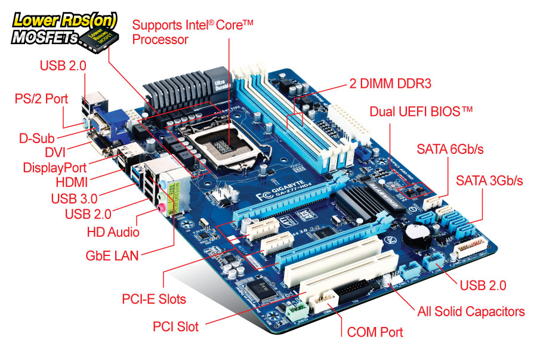
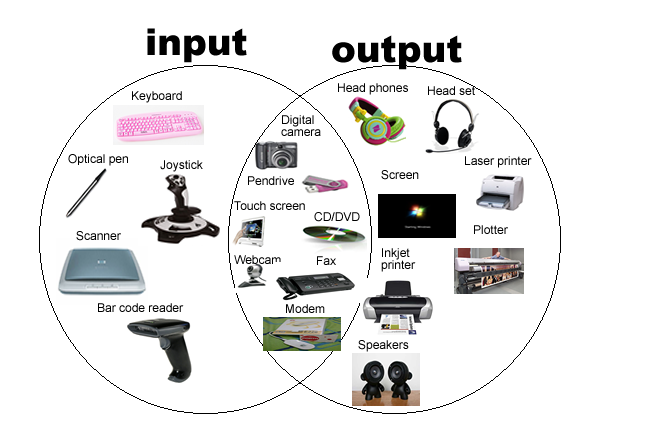
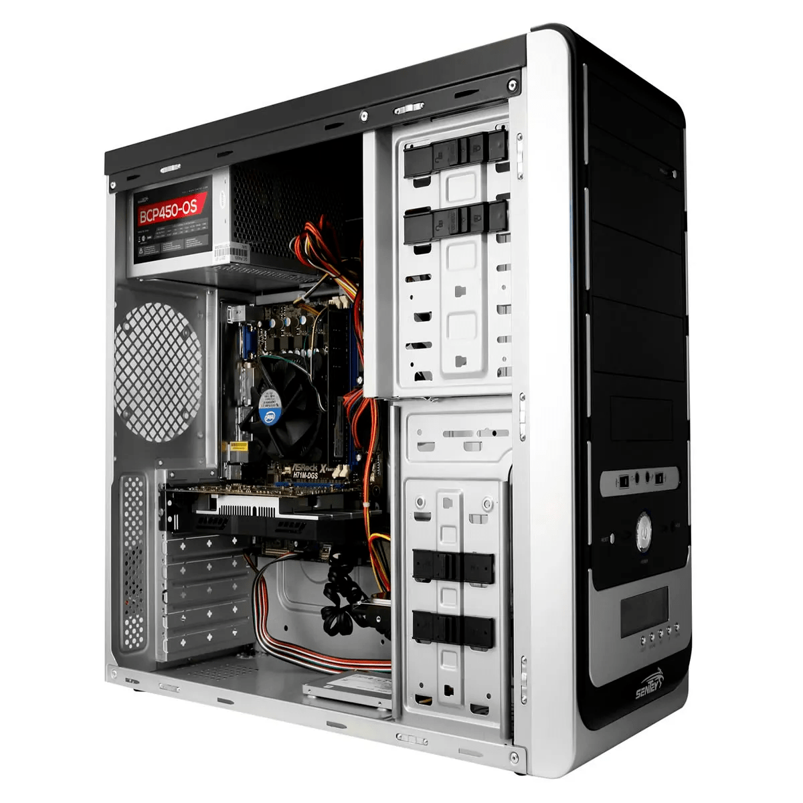
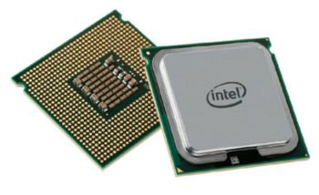
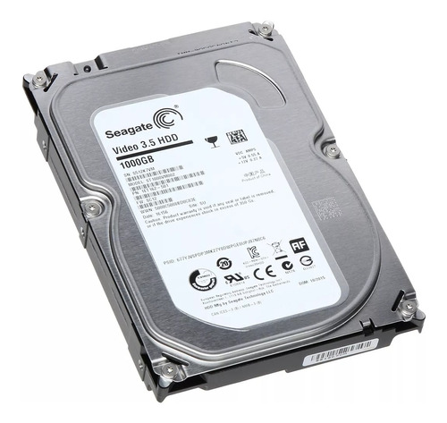
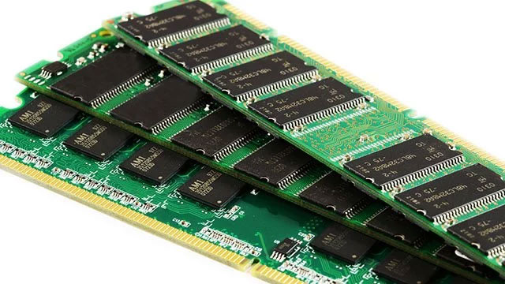
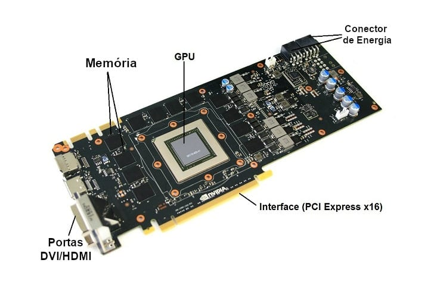

## Hardware

<!-- (Esta seccion hay que mandarla a un anexo o algo asi pero lo dejo para hacer al final, por ahora voy armando todo el contenido, la digramacion de la presentacion es posterior) -->

#### La electrónica

Todo lo que estamos acostumbrados a pensar como dispositivos electrónicos son en última instancia eso, dispositivos que manipulan corrientes eléctricas (o su contrapartida voltajes) para hacer cosas. Para interactuar con la realidad estos dispositivos suelen tener tres pasos: recibir información, procesarla y actuar en consecuencia. 

Para recibir información están los sensores que transforman alguna señal no eléctrica en eléctrica y permiten recibir información del entorno, ejemplo de esto pueden ser el teclado (que transforma presionar un botón en señales eléctricas), las pantallas táctiles (que encienden una señal cuando se acerca el dedo a cada zona especifica de la pantalla), o una webcam (que transforma información sobre la luz que le llega en una imagen digital). También podrían serlo un termómetro, sensores de proximidad, etc. Cualquiera sea el sensor que se utilice traduce un estímulo del mundo cotidiano en señales eléctricas digitales (voltajes encendidos y apagados o como se suele visualizar: ceros y unos).

Una vez que la información está digitalizada se la puede procesar de maneras muy diversas con muy diversos fines, de eso se encarga la electrónica mediante procesadores y microcontroladores.

Por último necesitamos que esa información procesada se refleje en algún cambio en el mundo externo. Desde un punto de vista electrónico a los dispositivos que se encargan de eso se los suele llamar actuadores. En una computadora ejemplos de actuadores son las pantallas (prender o apagan pequeños leds para formar imágenes en función de la corriente que les llegue), las impresoras (que dejan salir tinta o no y mueven con motores hojas para lograr una impresión), un router o antena wifi (donde se generan ondas electromagnéticas), o podría serlo en términos más generales cualquier tipo de motor controlado mediante electrónica, la resistencia eléctrica que calienta el agua en una pava eléctrica, etc. 

#### La PC y sus partes

##### Motherboard

Desde un punto de vista funcional, una PC se monta sobre el motherboard. El motherboard o "la mother" es un conjunto de electrónica, microcontroladores y cableado (o "bus" de conexión) que permiten la interconexión entre todas las demás partes de una computadora permitiendo que mediante ciertos estándares todas las partes que se conecten y puedan comunicarse con las demás. 

##### Los periféricos

Se llama periféricos a todos los componentes intercambiables (y no indispensables) que se suelen conectar a una computadora típica de escritorio. Los más comunes son: pantallas, teclado, mouse, webcams, impresoras, parlantes, micrófonos, etc. Todos estos periféricos tienen que intercambiar información con la computadora de alguna manera. Antiguamente las mother tenían conectores específicos para cada tipo de periféricos, con el tiempo se fue pasando a protocolos más estandarizados de comunicación que permiten en un mismo puerto (por ejemplo USB, o HDMI) conectar dispositivos muy diversos. Hoy día muchas veces la conexión se realiza inalámbricamente por bluetooth o wifi. En las computadoras portátiles o los modelos all-in-one todos los periféricos (y también las demás componentes internos) suelen venir integrados de fábrica y son más difíciles de reemplazar.

##### El gabinete 

El gabinete es la estructura metálica o plástica típicamente paralelepípeda donde se alojan todos los elementos que no son periféricos. Dentro del mismo se coloca la mother con todos elementos que se conectan a la misma y suele incluir "la fuente" (que transforma la energía de línea a un voltaje adecuado para cada uno de los componentes) así como conectores en la parte delantera y trasera más cómodos y estéticos que los originales de la mother. El gabinete además da la estructura sólida para que se puedan colocar ventiladores que ayuden a disipar el calor así como proteger los componentes de la intemperie. Muchas veces se generaliza y se llama CPU al gabinete y todo lo que hay dentro del mismo.

##### CPU (Central Proccess Unit)

Como ya mencionamos en una computadora toda la información que se manipula esta codificada en términos de corrientes y voltajes (cero y unos según haya voltaje alto o bajo). Todos los componentes electrónicos incluyen microcontroladores que realizan operaciones específicas sobre esas señales, pero las computadoras cuentan con una unidad de procesamiento mucho más potente que las demás que está diseñada para realizar operaciones conceptuales arbitrarias comandadas por el software que se esté ejecutando. De alguna manera el software corre en el procesador y todo lo demás es la infraestructura para que esto pueda suceder. El procesador recibe en cada momento la operación que debe realizar, lo cual incluye los datos correspondientes a esa instrucción y la instrucción en sí misma, por ejemplo sumar y que números sumar.

##### Unidad de almacenamiento - Disco Rígido

Si bien muchas veces queremos que la computadora interactúe con información que proviene del entorno (por ejemplo que cosas hacemos con el teclado o el mouse) hay mucha información que queremos guardar en forma permanente dentro de la computadora. Por ejemplo las fotos, documentos que creamos o la propia información del código del sistema operativo que tiene que permanecer en la computadora cuando la computadora está apagada para que se pueda volver a ejecutar al encender. Para guardar todo tipo de información las computadoras cuentan con unidades de almacenamiento interno (se suelen llamar disco rígido aunque ya no siempre son físicamente discos). Dentro de estas unidades la información se encuentra estructurada en unidades o discos, en carpetas y en archivos.  

##### Memoria RAM

A diferencia de la información que se guarda en el disco rígido cuyo objetivo es permanecer en el tiempo, buena parte de la información que se manipula dentro de la computadora es temporal (por ejemplo que secuencia de caracteres escribimos en el teclado, cuál es el contenido de la página web que estamos mirando, o las texturas que se están mostrando en el videojuego que tenemos abierto). Esta información no tiene que ser almacenada cuando la computadora se apaga (o cuando se cierra el programa que la usa) pero debe estar disponible de manera directa para cuando el procesador reciba la instrucción de procesarla. Para esto las computadoras cuentan con un tipo de memoria especial (que se caracteriza por ser de muy rápido acceso) que se llama RAM (Random Access Memory). La RAM es el lugar donde continuamente el procesador (y los programas que corren en él) están almacenando la información temporal que necesitan para ejecutarse.

##### GPU - Placa de video

Las placas de video (Graphics Proccess Unit) son componentes opcionales que se suelen agregar a las computadoras. Son una especie de mini computadora (incluye un procesador diseñado para optimizar operaciones gráficas, RAM y puertos propios de conexión) que está destinada a uno de los aspectos que en ciertos contextos más demanda a las computadoras que es generar los gráficos (renderizar) de juegos y aplicaciones de diseño. En caso de que una computadora no tenga placa de video agregada, la mother o la CPU suplen esta función con peor rendimiento. La importancia conceptual de las GPU es que al incluir potentes procesadores diseñados para operaciones particulares (y no generales como la CPU) algunos códigos de vinculados a la ciencia de datos que son muy intensivos en el uso de procesador se los puede diseñar para que se ejecuten de manera eficiente en una GPU. 

Así como las GPU tienen procesadores optimizados para operaciones de manipulación de imágenes hoy día existen procesadores de diseño específico que se pueden usar para tareas específicas. Por ejemplo Google diseño TPU, que son procesadores diseñados para ser muy eficientes usando TensoFlow que es un software de manejo de operaciones de IA (Inteligencia Artificial) y redes neuronales.
