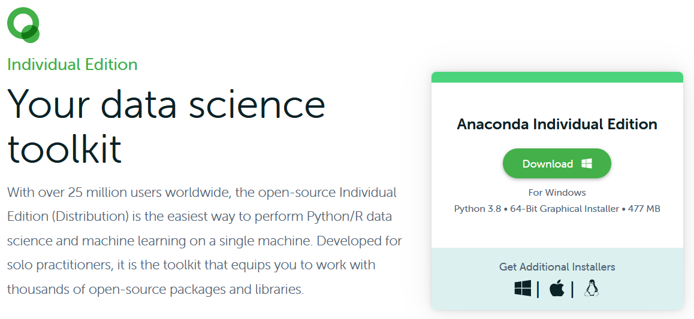
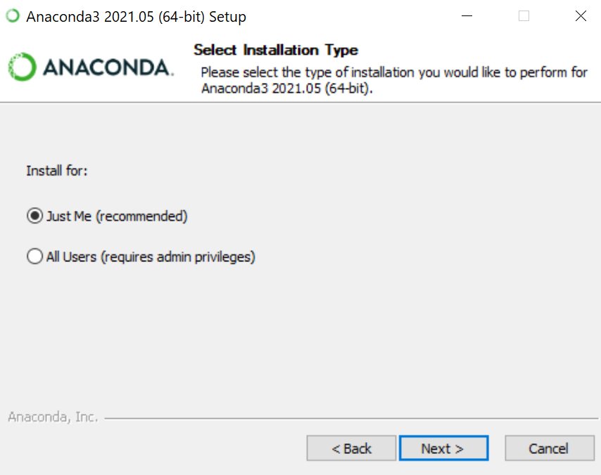
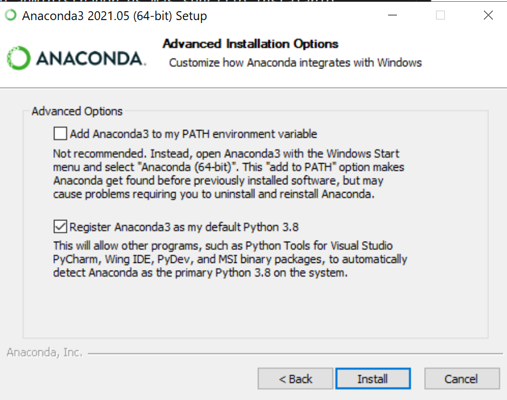
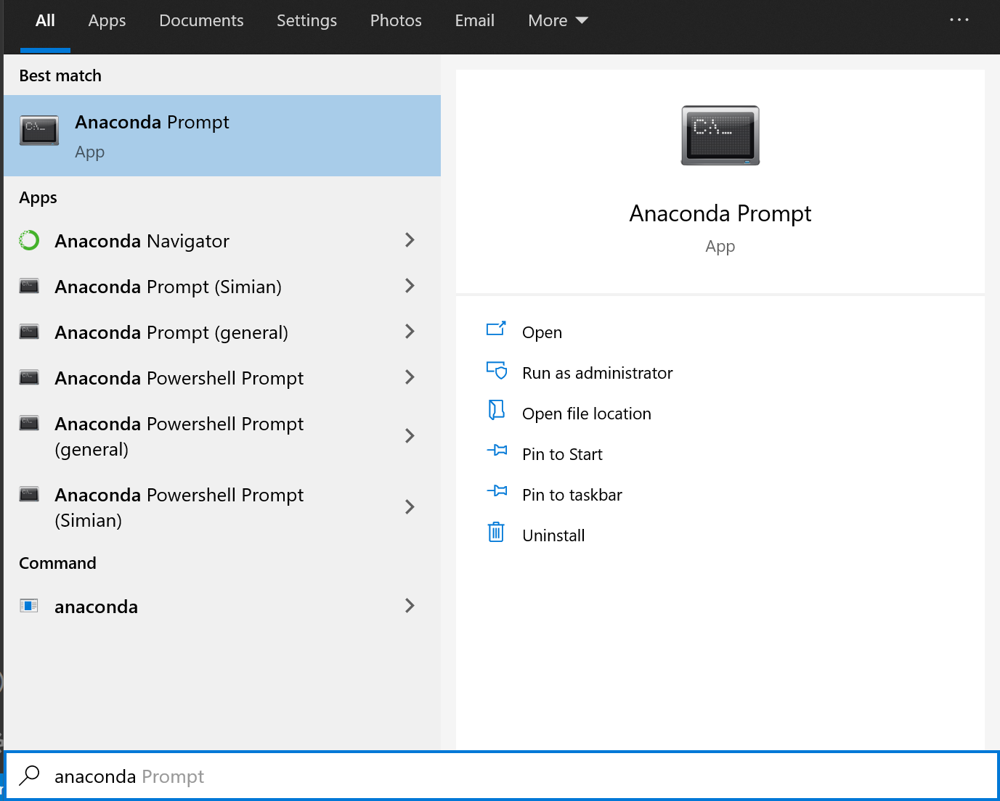
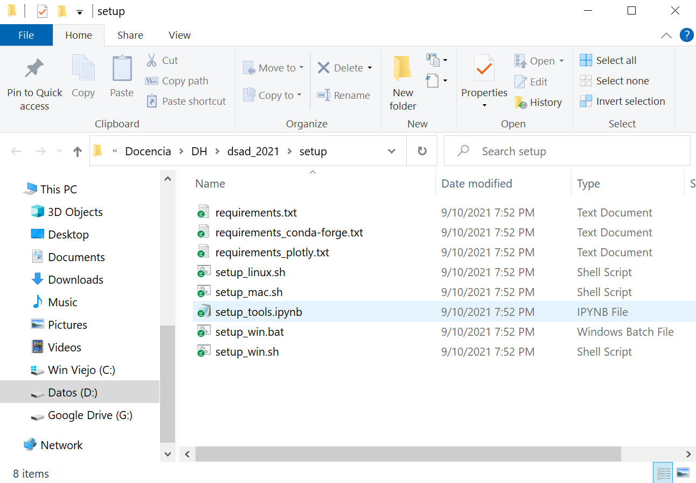
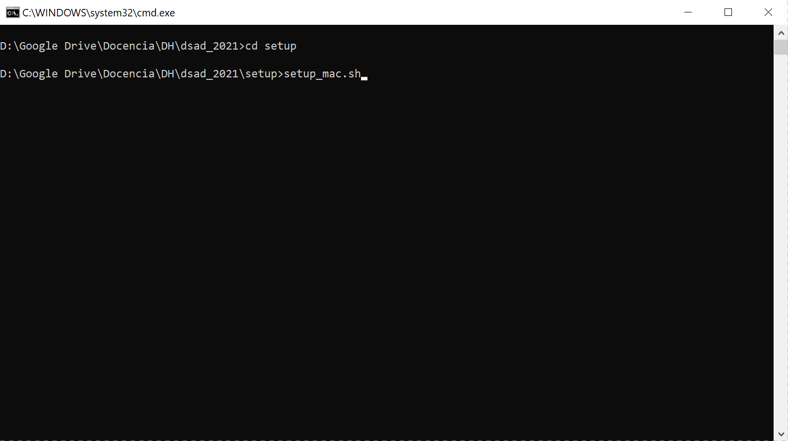
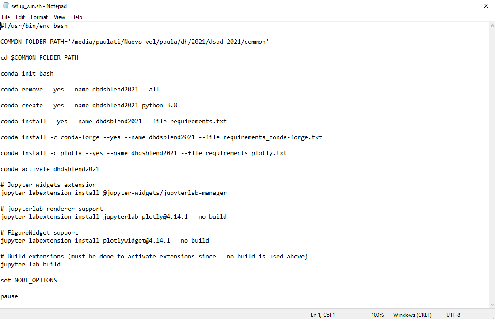
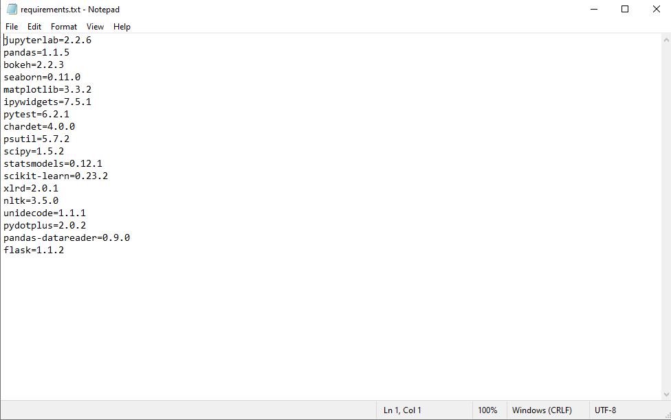

# Gestión de librerías

## ¿Para qué sirven las librerías?

Todos los lenguajes se construyen sobre un diseño básico que define reglas de sintaxis, operaciones y tipos de datos. Sobre eso, los lenguajes ofrecen funciones prearmadas que en ese ambiente resuelven cosas puntuales. Por ejemplo si tenemos definido la suma y el producto podemos definir la potencia de un número. 

Todos los lenguajes buscan ofrecer al usuario la mayor cantidad de problemas usuales ya resueltos para que el programador se pueda focalizar en el diseño y la solución de los problemas específicos sin preocuparse de cuestiones operativas o recurrentes que otro ya puede haber pensado antes. 

Python es un ecosistema abierto que tiene una enorme comunidad de desarrolladores y organizaciones que colaboran con su mejora continua, aportando soluciones y herramientas que están disponibles para quien las necesite. La manera de organizar este contenido es mediante librerías. 

Las librerías no son más que archivos con código de Python que se publican en repositorios de manera de organizar el material disponible y darle coherencia lógica y temática. Dado que Python es un lenguaje que permite hacer cosas de lo más diversas (desde programar videojuegos hasta procesar bases de datos o navegar por páginas web) es importante que los recursos ya disponibles estén ordenados y además que podamos indicarle al programa qué cosas necesitamos usar y cuáles no. De esta manera evitamos que tanto al instalar como ejecutar un programa se generen códigos, archivos e infraestructuras sobredimensionadas.

Por ejemplo, Python en su versión más pura incluye operaciones matemáticas básicas como la suma, el producto o la división, y tipos de datos numéricos como los enteros y los decimales. Pero no incluye operaciones o conceptos como los vectores o las operaciones trigonométricas porque salvo que vayamos a programar algo que involucre cálculos numéricos es poco común que estas cosas sean necesarias. Sin embargo para quienes necesiten hacer este tipo de operaciones no solo existe una librería (numpy) que ofrece estas funcionalidades, sino que además esta librería está muy optimizada para priorizar el tiempo de cómputo.

Importar librerías no solo permite obtener funcionalidades extras solo cuando son necesarias, sino que nos permite organizanos a la hora de escribir o pensar el código. Por ejemplo si queremos hacer una raíz cuadrada (sqrt en ingles) luego de importar numpy podemos escribir
```
numpy.sqrt(minumero)
```
y sabemos que estamos ejecutando la instrucción incluida en la librería numpy (y de esta manera por ejemplo podemos evitar confusiones de nombres con instrucciones similares de otra librería). 

## Gestores de paquetes y librerías

En el mundo interconectado hay muchas maneras de intercambiar información y herramientas, pero hay algunas soluciones que suelen imponerse por su difusión y practicidad. En el caso de las librerías de Python (y también otros lenguajes de uso similar como R) hay dos grandes paradigmas de gestores de librerías y paquetes de librerías: [Pip](https://pypi.org/search/?q=&o=) y [Conda](https://docs.anaconda.com/anaconda/packages/pkg-docs/). Cada una tiene sus puntos fuertes y sus debilidades, pero lo importante es que no son excluyentes (lo que ya veremos puede traer problemas de interferencia entre sí). El gestor de paquetes más común es Pip y suele venir instalado en el sistema operativo por defecto o bien porque cuando instalamos Python viene incluido. Conda es menos común, pero está ampliamente difundido y tiene herramientas intuitivas que facilitan 'aislar' lo que necesitamos del resto del sistema operativo y así evitar posibles conflictos. 

## Conda y Anaconda

Como mencionamos Conda es un gestor de paquetes y librerías, esto quiere decir que es un programa que es capaz de mirar que tenemos en nuestro sistema y pedir a demanda las librerías que necesitemos a algunos de los servidores donde estas se publican. Si bien esto parece sencillo el proceso implica buscar la versión de la librería que sea compatible con nuestro procesador y sistema operativo y también chequear que las dependencias (otras librerías o cosas que la librería use) se puedan satisfacer (e instalarlas) sin romper la estructura de cosas ya instaladas. 

### Anaconda

Las librerías más sencillas usan las funcionalidades nativas de Python para construirse y funcionar, pero a medida que requerimos y construimos cosas más complejas las librerías empiezan a usar cosas de otras librerías (o del sistema operativo) y necesitan códigos compilados especialmente optimizados para cada estructura de la computadora. Anaconda es lo que se llama una distribución, es decir un conjunto de librerías y herramientas organizadas con Conda que está pensada y actualizada para que tengamos a mano todo lo que usualmente usa alguien que programa en ciencia de datos. De esta manera si instalamos Anaconda nos estamos asegurando que tenemos prácticamente cualquier cosa de las que se suele usar.


### Entornos y versiones

Cuando estamos desarrollando un proyecto en particular es común que de todo el universo de librerías disponibles solo usemos unas pocas. Además puede pasar que durante el desarrollo de nuestro proyecto, o entre que lo desarrollamos y está en producción salgan actualizaciones de las librerías que usamos (o del propio Python que hace unos años paso de la versión 2 a la 3 lo que implicaba cambios en la sintaxis aceptada). Por eso es cómodo disponer de un ambiente (o entorno) en el cual podamos elegir con que versiones y librerías queremos trabajar en cada proyecto particular, aislando lo que modificamos en ese proyecto del resto del sistema operativo. Conda resuelve este problema permitiendo crear 'Enviroments' o espacios de trabajo donde podemos configurar las cosas como queramos sin afectar otros proyectos. 

Otra ventaja de usar entornos, es que podemos registrar en archivos '.txt' (que se suelen denominar 'requirements') que es lo que necesita un entorno para que el programa ande bien, entonces si queremos ofrecerle el código a alguien le podemos decir a Conda en un solo paso que nos cree el enviroment con todo lo necesario y nada más que lo necesario en la compu que vayamos a usar. 

### Como instalar Conda

Te vamos a contar como hacer la instalación del entorno de Conda que vamos a usar a lo largo del curso. Lo podés hacer a mano, o podés usar el archivo automatizado que te ofrecemos como alternativa. A lo largo de la instalación vamos a usar los conceptos de Conda y de uso de la consola que presentamos previamente.

#### Descargar Conda

Lo primero que tenemos que hacer es conseguir el instalador de Conda para que el gestor de paquetes esté andando en nuestra computadora. Lo podés descargar de esta [página](https://www.anaconda.com/products/individual) eligiendo según el sistema operativo que tengas. Los pasos son muy similares en todos los sistemas operativos, pero algunas cuestiones de forma durante la instalación pueden variar.




Tenemos la elección de elegir Conda o Anaconda. Si por alguna razón disponemos de una conexión a internet mala Conda es más liviano porque descarga inicialmente solo lo mínimo necesario, pero después deberemos descargar todas las librerías que usemos. Recomendamos usar Anaconda. En cambio si bajamos Anaconda descarga inicialmente todas las librerías usuales y si después las necesitamos ya están en nuestra computadora y simplemente las copia al entorno que estemos creando. 

Un detalle a considerar (sobre todo si queremos evitar futuras descargas innecesarias) es elegir la versión de Python que vamos a usar. Si bien ya está disponible la versión 3.9 la versión actual estable es la 3.8 (y es la que usamos). Lo importante es que no usemos cosas en Python 2 porque hay cosas de la sintaxis que son diferentes y las versiones 3.x no son retrocompatibles con las 2.x.

#### Proceso de instalación de Anaconda

El proceso de instalación es relativamente intuitivo y cuenta con interfaz gráfica, sin embargo vamos a remarcar algunas cuestiones que pueden surgir durante la instalación.

- En Windows puede preguntarnos si queremos instalar Conda para todos los usuarios (nos pide entonces permisos de administrador) o para el usuario actual. Si lo instalan como usuario común les va a crear todos los archivos en su carpeta personal **"C:\Users\\[User]\\Anaconda3"**, sino lo hará en alguna de las carpetas con programas del sistema operativo. Salvo que no tengan permisos de administrador es más sencillo instalarlo con administrador. Igualmente más adelante si usamos entornos nos independizamos del resto del sistema operativo. La única cuestión a considerar es que si lo instalamos como administrador, más adelante si queremos actualizar las librerías principales (como la versión del Python) tenemos que ejecutar el comando de actualización desde una consola con permisos de administrador.



- En Windows durante la instalación nos pregunta si queremos agregar Anaconda3 al "Path" del sistema, esto determina que podamos ejecutar comandos Conda desde una terminar cualquier o no. Si ponemos que no igualmente podemos ejecutar los comandos Conda desde una consola especializada de Conda, es más seguro porque interferimos menos con el sistema, pero hay que estar eligiendo que consola usar. 



Si bien los tamaños de los archivos involucrados en la instalación de Anaconda y sus librerías no es tan grande, Conda es sorprendentemente lento a la hora de instalar librerías porque realiza muchos chequeos para saber que es lo que tiene que instalar. Simplemente hay que tenerle paciencia. 

#### Consola de Conda

Una vez que instalamos Anaconda o Conda debería aparecer en el menú inicio (en windows), o directamente lo ejecutamos en la consola en Linux o MacOS. 



Nosotros para la instalación de todo lo necesario vamos a usar la consola (cuando uno se acostumbre permite mucho control sobre las instrucciones), pero también se puede usar el "Anaconda Navigator" en caso de preferir hacer las cosas con interfaz gráfica.

#### Proceso de creación y configuración del entorno.

Lo que queremos hacer es crear un entorno de trabajo que nos permita separar lo que ejecutemos durante el curso del resto del sistema operativo y donde además nos aseguremos de tener todos exactamente las mismas versiones de las librerías que usemos (aunque no sean las últimas) para que cualquier problema que surja podamos dar soporte y testear los códigos en otras computadoras.

Para eso armamos un archivo ejecutable con instrucciones de consola que hace todos los pasos necesarios. Podés descargarte todos los archivos con la información necesaria y ejecutarlo, o podés hacerlo paso a paso donde te vamos a explicar que hace cada instrucción. 

Para conseguir los archivos vamos a usar el [repositorio](https://github.com/Digital-House-DATA/dsad_2021) de Github donde está todo el contenido que vamos a usar en la clase. Si sabes usar Git podés clonar el repo y acceder a la carpeta Setup. Si no sabes usar Git no te preocupes (ya lo vamos a ver más adelante), simplemente abrí este [archivo](https://github.com/Digital-House-DATA/dsad_2021/archive/refs/heads/master.zip) que es un archivo comprimido, y descomprimí la carpeta Setup en algún lugar que tengas identificado en tu computadora. 

Si estas en Windows deberías tener una carpeta que se vea de esta manera:



En esta carpeta hay ocho archivos, tres (los que terminan en .sh) tienen instrucciones para ejecutar comandos de consola según el sistema operativo que usemos. El archivo .bat es similar al .sh pero es formato nativo de Windows, si ya instalaron Git pueden usar el ".bat" o el ".sh" sino tienen que usar el ".bat". Ademas tenemos tres archivos .txt con requerimientos de librerías vinculadas a diferentes cosas que vamos a ver en el curso. Por último tenemos un archivo .ipynb que es una notebook de Jupyter (ya vamos a ver que eso) que nos permite chequear que se haya instalado todo bien.

Si ejecutamos el archivo setup_win.sh (podemos hacerlo con doble clic o yendo a la carpeta desde la consola y escribiendo su nombre) vamos a ver que se abre una nueva ventana donde se ejecuta su contenido. Como ya mencionamos Conda es lento en reconocer que cosas hay ya instaladas, que cosas no, e instalarlas, por lo que tenemos que tener paciencia hasta que se terminen de ejecutar todas las instrucciones. 



Si abrimos ese mismo archivo con un block de notas podemos entender que es lo que le estamos pidiendo a Conda que haga. A continuación vamos a explicar los fundamentos básicos de las líneas



Las lineas 

```
#!/usr/bin/env bash

COMMON_FOLDER_PATH='/media/paulati/Nuevo vol/paula/dh/2021/dsad_2021/common'

cd $COMMON_FOLDER_PATH
```

tiene que ver con configurar el bash (consola donde se ejecutan las instrucciones) de Windows o el equivalente en los demás sistemas operativos, pero no son instrucciones de Conda. 

```
conda init bash
```
Inicializa Conda en esta consola para que se pueda usar todas las instrucciones. Si usamos una consola propia de Conda no hace falta ejecutar esta línea.

```
conda remove --yes --name dhdsblend2021 --all
```
Esta línea hace una limpieza por si ya teníamos algo parecido instalado previamente:
- "remove" remueve cosas de un entorno, 
- con "--yes" estamos indicando que no queremos que nos pida confirmación de cada cosa que vaya a hacer (normalmente cuando escribimos las instrucciones una a una en la consola nos pide confirmación por las dudas, pero como acá estamos dentro de un script automatizado es muy poco práctico y se supone que ya revisamos que las instrucciones sean las correctas). Esto aplica a cualquier instrucción que escribamos,
- "--name" sirve para indicarle el nombre del entorno en el que queremos que se ejecute lo que pedimos, y "dhdsblend2021" es el nombre que estamos eligiendo para el entorno en el que vamos a trabajar durante el curso.
- "--all" indica que remueva todo lo que encuentre en ese entorno (incluyendo el propio entorno en si)
  
```
conda create --yes --name dhdsblend2021 python=3.8
```
Con esta línea creamos el entorno (por primera vez o nuevamente en caso de que lo acabáramos de borrar):

- "create" sirve para crear entornos,
- "--name dhdsblend2021" indica nuevamente el nombre del entorno a crear,
- "python=3.8" indica que queremos un entorno que pueda ejecutar las instrucciones básicas de Python y que la versión que queremos usar es la 3.8

```
conda install --yes --name dhdsblend2021 --file requirements.txt
```

Con esta línea instalamos parte de las librerías necesarias en nuestro entorno:

- "install" sirve para instalar librerias,
- "--name dhdsblend2021" indica nuevamente el nombre del entorno donde instalar las cosas,
- "--file" indica que queremos busque en un archivo la lista de cosas que tiene que instalar y "requirements.txt" es el nombre del archivo donde está la lista de librerías que queremos.

A continuación mostramos el contenido de requirements.txt donde cada línea indica el nombre de la librería y su versión exacta que buscamos. Si no establecemos la versión Conda busca la versión más actualizada compatible con el resto del entorno. 



Entre estas librerías podemos destacar:

- [jupyterlab](https://jupyter.org/): es el entorno que permite ejecutar notebooks (más adelante lo explicamos más en detalle)
- [pandas](https://pandas.pydata.org/): es una librería muy útil y con un montón de herramientas para manipular dataset o tablas de datos.
- [matplotlib](https://matplotlib.org/stable/gallery/index.html): librería básica para hacer gráficos.
- [seaborn](https://seaborn.pydata.org/): librería que fusiona pandas con matplotlib para automatizar y embellecer los gráficos y visualizaciones que se pueden armar. 
- [scikit-learn](https://scikit-learn.org/stable/): librería fundamental para hacer ciencia de datos con modelos de aprendizaje, incluye y sistematiza todas las herramientas típicas necesarias para estas tareas.
- [flask](https://flask.palletsprojects.com/en/2.0.x/): librería que permite embeber códigos de Python en un entorno html para desarrollar aplicaciones web.

Además de las librerías que figuran en el archivo, durante la instalación Conda revisa que todas las dependencias que estas librerías necesitan estén satisfechas, por eso cuando le pedimos que instale ciertas librerías puede que instale muchas más que las que pedimos explícitamente, porque sin las librerías extras lo que pedimos no funcionaria.  

```
conda install -c conda-forge --yes --name dhdsblend2021 --file requirements_conda-forge.txt
```

Instrucción similar a la anterior, la diferencia es que indicamos con la "-c" el 'channel' o canal desde donde queremos que se instalen las librerías. Esto significa que en lugar de utilizar el repositorio predeterminado de Conda le pedimos que utilice alguno especial. En este caso el "conda-forge" que tiene versiones sin limitaciones de derechos de uso. Dentro de "requirements_conda-forge.txt" figuran las librerías que por alguna razón no queremos instalar desde el canal predeterminado. 

```
conda install -c plotly --yes --name dhdsblend2021 --file requirements_plotly.txt
```

Al igual que el caso anterior en el archivo "requirements_plotly.txt" tenemos la lista de librerías necesarias para instalar [Plotly](https://plotly.com/) que es un conjunto de herramientas que sirven principalmente para hacer gráficos y visualizaciones interactivas vía interfaz web y javascript y que son compatibles con Python pero también con otros lenguajes como R o Julia.

Por último tenemos las instrucciones vinculadas a configurar e instalar plug-ins en Jupyer. De estas instrucciones la única que es de Conda es la primera "conda activate dhdsblend2021" que indica a Conda que nos meta dentro del entorno dhdsblend2021 que es el que acabamos de instalar y donde vamos a querer ejecutar todos los códigos y librerías, incluyendo Jupyter.

```
conda activate dhdsblend2021

# Jupyter widgets extension
jupyter labextension install @jupyter-widgets/jupyterlab-manager

# jupyterlab renderer support
jupyter labextension install jupyterlab-plotly@4.14.1 --no-build

# FigureWidget support
jupyter labextension install plotlywidget@4.14.1 --no-build

# Build extensions (must be done to activate extensions since --no-build is used above)
jupyter lab build
```


  

