# Git

## ¿Qué es Git?

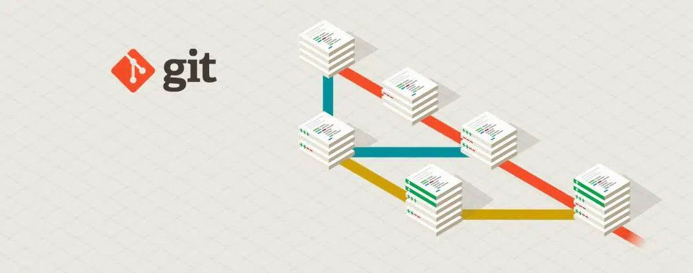

Git es un programa de control de versiones. ¿Qué significa eso? Que es un programa que sirve para monitorear y organizar los cambios que hacemos en uno o varios archivos. La utilidad que puede tener un programa como este es enorme y es uno de esos casos donde típicamente no nos damos cuenta de lo útil que es hasta que por alguna razón lo empezamos a usar. Usarlo no es difícil, pero tampoco trivial, por eso, aunque vale la pena, muchas veces la gente tarda en descubrir todo lo útil que Git es. En esta guía te vamos a contar las funcionalidades básicas de Git, como usarlo y como instalarlo.


## Problemas comunes que resuelve Git

Probablemente más de una vez estabas editando un documento largo e importante quisiste guardar las versiones preliminares de lo que estabas haciendo (porque querías tener registro o por si necesitabas revertir algún cambio en el futuro). Lo que uno suele hacer en esos casos es ir cambiándole el nombre al archivo con cosas como miArchivoV1 o miArchivoV3_revisada. Para peor muchas veces ese mismo archivo lo tiene que revisar otra persona y entonces empezamos a complicar los nombres (porque entre que lo enviamos y recibimos las respuestas ya hicimos más modificaciones), o terminamos el trabajo y tenemos en la carpeta miArchivo_versionFinal_2_posta junto a todas las "versiones finales" anteriores. 

Todos estos problemas se generan porque cada vez que queremos hacer modificaciones pensamos que lo lógico para preservar la información anterior es guardar una copia en un archivo diferente, cuando en realidad estamos generando un montón de información duplicada, y además estamos perdiendo el hilo de cuáles fueron las modificaciones hechas. Pero los programas usuales de computadora trabajan así, con un archivo y nos muestran todo su contenido, entonces si queremos preservar copias de versiones anteriores o queremos enviarle una copia a alguien para que la revise hay que hacer eso, copias y más copias. 

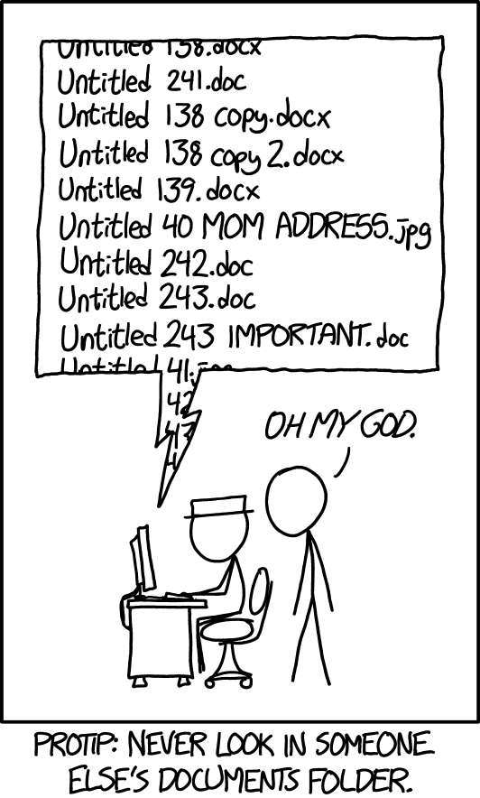

Una solución parcial a estos problemas la dan los editores y gestores de archivos online (estilo Google Drive), porque permiten que más de una persona trabajen en el mismo archivos (no enviamos el archivo para que alguien lo revise, sino un link al archivo nuestro que está en el servidor) y porque (dependiendo del tipo de contenido que tengan) incluyen algunas herramientas de revisión (como control de cambios, comentarios, etc.). Pero siguen siendo un poco parche, porque no sirve con cualquier tipo de contenido, dependemos de tener todo online y además la lógica que usan los servidores es similar a lo que hace Git.

## Como los resuelve Git

Imaginemos ahora que tenemos Git instalado y funcionando (ya vamos a ver cómo se hace esto más adelante), y queremos empezar a escribir un proyecto, por ejemplo el trabajo final de una materia. Para eso creamos una carpeta y empezamos a escribir un documento de Word. Creamos algunas imágenes (que guardamos en la misma carpeta) y después de un día de trabajo tenemos una primera versión (incompleta). Entonces lo que hacemos es "commitear" todo lo que hicimos. ¿Qué significa eso? Que le decimos a Git que revise que encontró de nuevo en nuestra carpeta y guarde un registro (Git guarda todos los registros internos en una carpeta que se llama '.git' dentro de la carpeta de nuestro proyecto). 

Al día siguiente nos damos cuenta que en realidad convenía organizar el contenido de otra manera y además agregamos un capítulo nuevo y tres imágenes más. Cuando terminamos de hacer los cambios volvemos a "commitear" y entonces Git no guarda ni sobreescribe una copia de lo que hicimos, sino que busca cuáles fueron las modificaciones respecto del "commit" anterior y guarda un registro histórico de esas modificaciones. De esta manera, si dos días después descubrimos que nos gustaba más el orden original de los capítulos podemos pedirle a Git que nos reconstruya y muestre cuál era el estado del archivo cuando hicimos el primer "commit", miramos cómo era esa versión del archivo, tomamos y recordamos lo que nos gustaba y después volvemos a la última versión para modificarlo en ese sentido y seguir trabajando.

Además por supuesto puede pasar que dejamos la compu prendida, pase el gato y aprete teclas al azar y nos borre la mitad del trabajo. No desesperamos porque aunque se haya guardado la última versión dañada siempre podemos volver a la versión anterior y seguir trabajando desde ahí. 


Git también soluciona el problema de enviarle el archivo a otra persona y que nos lo devuelva corregido sin que tengamos que estar esperando entre medio o tengamos que estar pidiendo que nos remarquen todos los cambios. Si bien hay una manera mucho más alegante de hacerlo que vamos a ver más adelante, vamos a ver cuál sería la lógica básica para hacerlo:

- Enviamos por mail la versión que tenemos del archivo.
- Seguimos trabajando en un capítulo nuevo. 
- Recibimos el archivo con correcciones por mail.
- Hacemos un "commit" que llamamos "premerge". 
- Le pedimos a Git que nos compare la versión en "premerge" con la versión recibida por mail marcando las diferencias. Git se da cuenta cuando se cambió una parte por otra y lo muestra de manera similar al control de cambios de Word.
- Evaluamos cada modificación y decidimos cuáles queremos incorporar a nuestra versión del proyecto. O simplemente incorporamos todos los cambios en un paso. En caso de que haya algún conflicto (la otra persona modifico la misma frase que nosotros) podemos elegir que versión queremos quedarnos.
- Seguimos trabajando con las revisiones incorporadas.

Igualmente remarcamos que esta es la idea de como funcionaría, pero si la otra persona sabe usar Git hay una manera mucho más sencilla y elegante de hacerlo. 

## Algunas funcionalidades más avanzadas de Git

Además de servir para hacer un cómodo control de versiones, poder recuperar versiones viejas o ver las modificaciones entre una versión y otra, Git permite hacer ramas. Esto tiene poco sentido al hacer por ejemplo un trabajo final de una materia, pero tiene mucho sentido cuando uno programa código. 

¿Qué es una rama? Es una ramificación del código original en el que uno puede trabajar sin alterar la versión original hasta que considere que las modificaciones valen la pena. Imaginemos que tenemos el código de un proyecto funcionando, y que además hay gente usándolo. Queremos agregar una funcionalidad nueva (o corregir algún error) y para eso tenemos que hacer pruebas y modificaciones que van a dejar al código "fuera de servicio". Sin Git deberíamos crear una copia de todo el proyecto, hacer ahí las modificaciones y después reemplazar todo el proyecto original por el nuevo. Pero puede pasar que ese proceso lleve meses y en el medio hagamos algunas modificaciones menores al código principal que sean útiles, o puede pasar que entre medio otra persona aporte cosas que valen la pena al proyecto original y si hicimos una copia vieja las perdamos. 

Para solucionar estos problemas con la misma lógica de Git, existen lo que se llaman ramas (o branchs). La idea es que uno puede crear una ramificación donde va desarrollando las funcionalidades nuevas que uno quiera, y cuando termina de trabajar en esa ramificación le pide a Git que fusione (haga un "merge") de los cambios con el proyecto principal. De esta manera si hubo modificaciones útiles en el proyecto principal estas perduran al merge y si alguien estaba usando el código siempre tuvo disponible una versión funcional del mismo. 

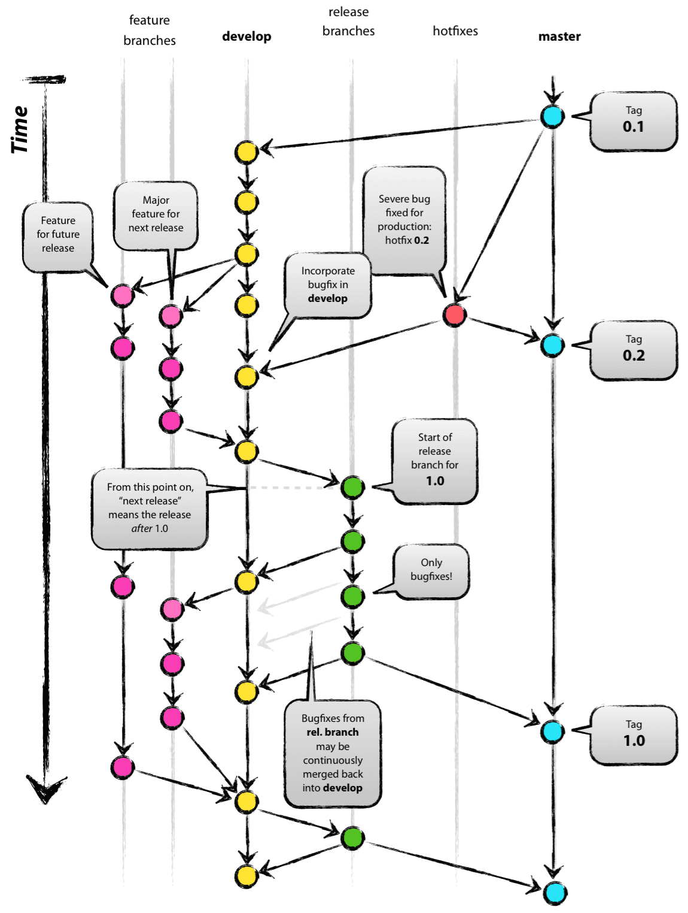

## GitHub

Probablemente uno de los mayores avances en el mundo de la programación tenga que ver con el uso de GitHub. GitHub como su nombre lo indica esta vinculado a Git, pero no es lo mismo. Git es un software que cualquier puede descargar y usar en su computadora. GitHub es un servidor que ejecuta Git y ofrece servicios (existen otros como GitLab o servicios internos de empresas). 

Lo que ofrece GitHub es un servicio de repositorio de proyectos integrado a Git. Es decir que además de tener yo mi proyecto en mi computadora personal puedo subirlo a GitHub y compartirlo con otras personas. Como el servidor está integrado a Git, no solo puedo compartir el código de lo que programe con quien quiera usarlo en el mundo entero (uno de los usos principales de GitHub), sino que se puede habilitar a otras personas a que colaboren en el código del repositorio usando Git. 

De esta manera GitHub (o sus equivalentes) son la principal plataforma de trabajo colaborativo para desarrollar software. Uno publica su código, otra persona puede accederlo, hacer modificaciones y proponer cambios con Git que el propietario original puede aceptar. O simplemente otras personas aprovechan y usan los códigos que uno escribió en sus propios proyectos. 

## Como instalar Git

Como instalar Git dependen del sistema operativo en el que estemos trabajando. En macOs suele venir instalado, en linux debemos ejecutar 

```
sudo apt install git 
```

desde una consola, y en Windows debemos descargar el instalador desde la [página](https://git-scm.com/downloads) oficial.

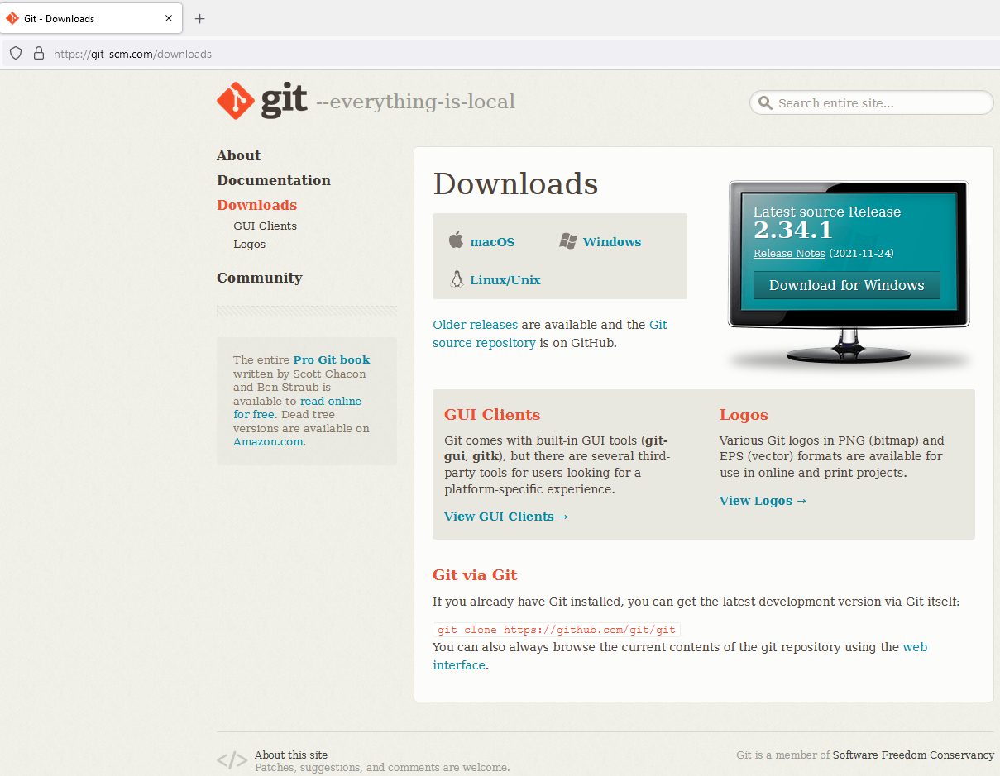

### Instalación en Windows

Debemos descargar la última versión del instalador (en este caso es la 2.34.1) y ejecutarlo.

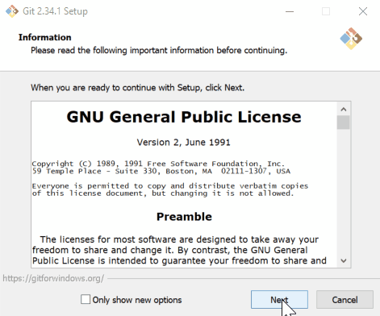

Durante la instalación Git pregunta muchas cosas vinculadas a cuestiones configuración. Conviene dejar todo en las opciones predeterminadas, pero vamos a remarcar algunos ítems:

- En la instalación es probable que aparezca la pantalla para pedir permisos de administrador.
- En la segunda pantalla nos pregunta que editor queremos utilizar para visualizar las cosas. Esto es porque Git puede necesitar por ejemplo mostrar las diferencias entre dos versiones cuando se fusionan y para eso hace falta algún tipo de editor de texto. En el caso del ejemplo seleccionamos usar Visual Studio Code (que es un excelente entorno de programación, pero puede ser cualquier otro software que ya esté instalado en la computadora). Dependiendo de cómo usemos luego Git esta elección puede ser irrelevante, ya que si por ejemplo programamos en Visual Studio Code automáticamente se integra al Git y esta opción la ignora. 
- Cuando usemos GitHub vamos a necesitar un usuario y contraseña que Git puede recordar para no pedirlos cada vez que queremos interactuar con el servidor. En caso de estar en Windows, el sistema operativo posee su propio gestor de credenciales y podemos poner que Git use el gestor de credenciales del sistema operativo que es más cómodo. 
- Históricamente a la rama principal de un proyecto se la llamaba "master" en contraste con las demás que serian "slaves". Desde hace un tiempo por cuestiones de uso de lenguaje se pasó a una convención más políticamente correcta donde a la rama principal se llama "main". Esto puede generar cierta confusión de nombres durante la transición.
- Si dejamos las opciones predeterminadas Git instala en el sistema operativo una consola propia con todas las funcionalidades de Git y algunos extras visuales, sin embargo también registra Git en el sistema operativo para que pueda ser usado desde cualquier otra consola o programa que lo requiera.

A continuación deberíamos abrir una consola, probar que Git esté bien instalado y comenzar a utilizarlo, pero antes vamos a ver como crear un repositorio en GitHub.

## Crear un repositorio en Github

Git se maneja con la lógica de proyectos, donde cada proyecto está en una capeta e incluye todos los archivos que haya dentro. Cuando compartimos o sincronizamos un proyecto local con un servidor nos solemos referir a ese proyecto como un repositorio, y cada repositorio (o repo) se puede subir y manipular en forma independiente en el servidor. 

Lo primero que necesitamos para poder crear y tener un repositorio en GitHub es haber creado una cuenta. Vamos a suponer que ese paso lo hicieron y vamos a ver cuáles son los siguientes pasos para una vez registrados crear un repositorio. Durante el curso les vamos a compartir un repositorio ya armado que tiene todo lo necesario para la cursada, pero para poder acceder a ese repositorio (que no es público) van a necesitar tener una cuenta de Github, y además saber crear un repositorio les va a permitir armar sus propios proyectos.

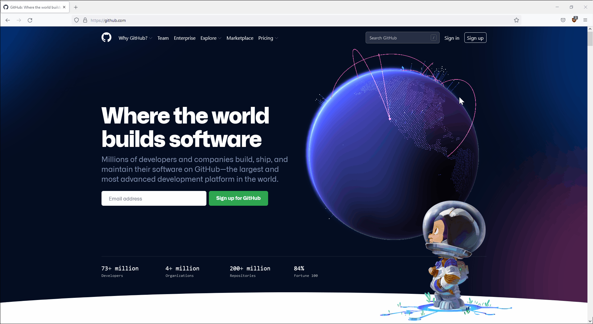

Un repositorio tiene un nombre, que es el nombre del proyecto. Tienen que ser nombres sin espacios. Además tiene una descripción que es una descripción breve del contenido que uno espera tener en ese proyecto. En Github los repositorios pueden ser públicos o privados. Si son públicos cualquier persona en internet puede acceder al contenido (puede verlo pero no modificarlo). Si es privado podemos elegir quienes pueden ver el contenido y quienes pueden modificarlo. 

Además cuando inicializamos el proyecto Github nos ofrece crear dos archivos iniciales, un readme.md que es un archivo de texto (en formato [MarkDown](https://markdown.es/)) donde se espera que haya un mensaje explicativo para quien mire el proyecto y un archivo .gitignore que tiene instrucciones para Git de que archivos no monitorear. Esto tiene sentido porque muchas veces los lenguajes con los que trabajamos crear archivos propios o temporales durante la ejecución que no son parte de lo que queremos que se guarde. Github viene con planillas típicas del archivo gitignore según en que lenguaje vayamos a programar. En el ejemplo usamos Python. 

Además de estos dos archivos cuando inicializamos un proyecto se crea una carpeta .git (que Github ni nos muestra) donde Git maneja toda la información interna necesaria para manipular el proyecto. Esta carpeta y su contenido nunca hay que modificarla a mano. 

Una vez que creamos el repositorio vemos que hay dos archivos y Github nos muestra el contenido del readme.md, pero si queremos podemos visualizar el contenido del .gitignore haciendo clic en su nombre. 

Por último podemos ver en el botón "Code" que podemos descargar el contenido del proyecto o copiar el link al proyecto. El link de un proyecto de Github y su URL son muy similares, solo cambia en que el link al proyecto (que sabe manipular Git) termina en ".git". Como este proyecto que creamos es público pueden accederlo desde la URL https://github.com/IonatanPerezEjemplos/MiPrimerRepo

### Modificar un proyecto desde Github

Como quizás habrán notado durante la creación del proyecto tuvimos dos errores de tipeo en la descripción del proyecto. Escribimos porbar en lugar de probar y falto una a en "primer vez". Vamos a aprovechar este error para mostrar la lógica detrás de las modificaciones de un proyecto de Git usando directamente Github (más adelante vamos a ver como hacerlo desde Git propiamente dicho en sus computadoras) para corregir el primero de los errores.

Lo que queremos hacer es editar el archivo readme.md, corregir el error y commitear los cambios. 

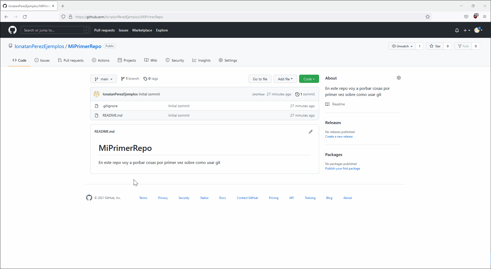

Como vemos el propio sitio de Github nos permite editar los archivos de texto (la mayor parte de los códigos se escriben y guardan en archivos de texto). Luego de la edición queremos "guardar". En este caso, como no tenemos un conjunto de archivos por fuera del proyecto, la acción de guardar esta asociada a hacer un commit (en nuestras computadoras podemos guardar y editar todo lo que queramos antes de hacer un commit). Todo commit tiene que tener una descripción, aunque sea breve. 

Una vez que hicimos el commit podemos volver al home del proyecto y vemos que el archivo se actualizó, pero además nos muestra que la última versión de ese archivo corresponde a un commit diferente al commit inicial. Cada commit se identifica por un Id, pero nos lo muestra por su descripción. Si hacemos clic en la descripción del commit, Github nos muestra los cambios que se hicieron en ese commit. Como vemos en el inicial se crearon los dos archivos, y en el segundo se modificó el archivo readme.md. Con colores nos indica que líneas se quitaron y con cuál se reemplazaron. De esta manera en un proyecto de Git podemos reconstruir la historia de todos los cambios que se hicieron. 

### Aceptar invitaciones de Github

Como durante el curso vamos a trabajar con contenido que está subido a un repositorio de Github privado es importante que tengan una cuenta de Github y acepten la invitación para poder acceder al contenido del curso que está disponible ahí. Para eso simplemente tienen que revisar el mail donde les va a llegar la invitación y aceptarla. Una vez que lo hagan su cuenta de Github va a agregar un repositorio que no está creado por ustedes al que van a tener acceso para copiar el contenido. 

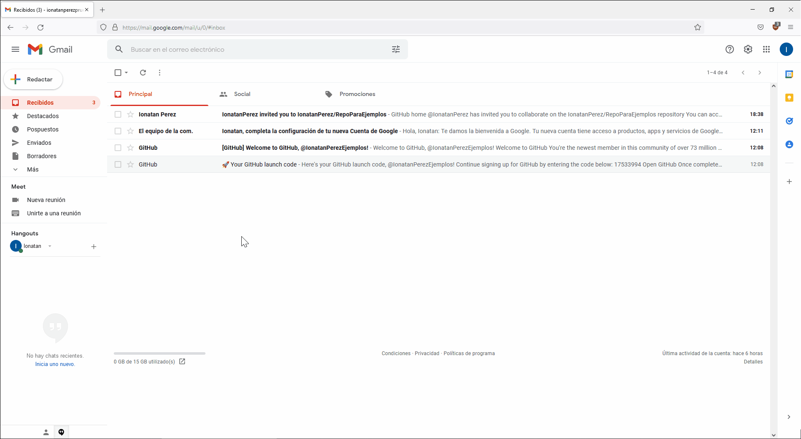

Es importante que en el repositorio del curso hay archivos que van a necesitar para configurar el entorno de programación de Conda, la manera más sencilla de conseguirlos es que acepten la invitación y descarguen el material desde el repositorio del curso. 

## Instrucciones básicas de Git

Antes de explicar las funcionalidades básicas de Git conviene repasar la lógica de los estados en los que puede estar un archivo para Git. Git tiene cuatro "versiones" o "estados" donde el archivo puede existir (en muchos casos en simultáneo). El más intuitivo es la carpeta de trabajo. Es lo que vemos con el navegador de archivos o el programa con el que editamos códigos. Ahí hacemos las modificaciones que luego Git procesara. 

Originalmente los archivos en la carpeta de trabajo son marcados como "sin seguimiento" salvo los que están listados en el archivo .gitignore que directamente se ignoran. Con el comando add podemos "pasar" o agregar los archivos cuyos cambios nos interese registrar al Stage. Eso significa que para Git en esos archivos hay modificaciones que nos interesa procesar, pero todavía no las registramos en el historial de cambios. Una vez que juntamos todas las modificaciones que queremos podemos pasar los archivos del Stage al repositorio con un commit. Con esta instrucción se incorpora un nuevo punto en el historial de cambios.

La idea de que haya un Stage y no se incorpore directamente todo cambio al repositorio sirve entre otras cosas para que los commits tengan una lógica según el contenido y podamos commitear los archivos modificados que involucran un cierto contenido pero podamos no commitear los archivos cuya modificación responde a otra lógica. Recordemos que cada commit involucra una explicación de las modificaciones y es un punto en la historia de cambios que se va construyendo. 

Además de las versiones locales de nuestro repositorio, Git suele trabajar con un repositorio remoto (en algún servidor) con el que puede sincronizar las versiones locales de los archivos y sus modificaciones.


### Clone

La instrucción de git clone sirve para clonar un repositorio online (por ejemplo de Github) en la computadora local y dejarlo vinculado de manera que después se puedan sincronizar de manera fácil. Alternativamente se puede inicializar un Git de manera local y luego vincularlo.

Vamos a ver como se hace para crear un repositorio nuevo en Github (que llamaremos Curso_DH) y como hacer para clonarlo en la computadora local ejecutando desde una consola el comando 

```
git clone [URL]
```

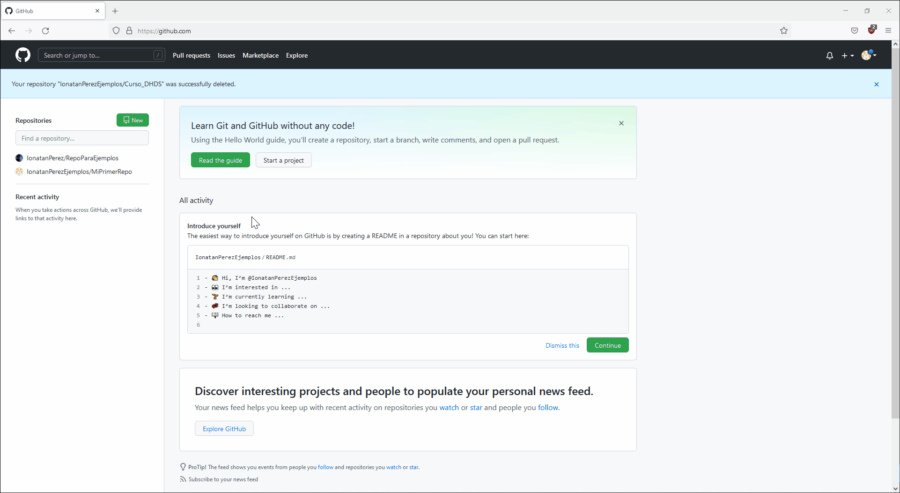

Es importante que la primera vez que ejecutemos git todavía no sabe cuál es nuestro usuario y contraseña por lo que si el repositorio no es público no lo va a encontrar. 


Vemos que una vez que clonamos el proyecto se genera una carpeta en nuestra computadora con el nombre del proyecto que dentro tiene los archivos que había en el proyecto de Github (vemos que esta también la carpeta .git que tiene toda la información interna del seguimiento y que no tenemos que modificar a mano nunca).

Vamos a mostrar como se ve (y puede hacer lo mismo) de Visual Studio Code, uno de los entornos más comunes de programación que integra las funcionalidades de Git

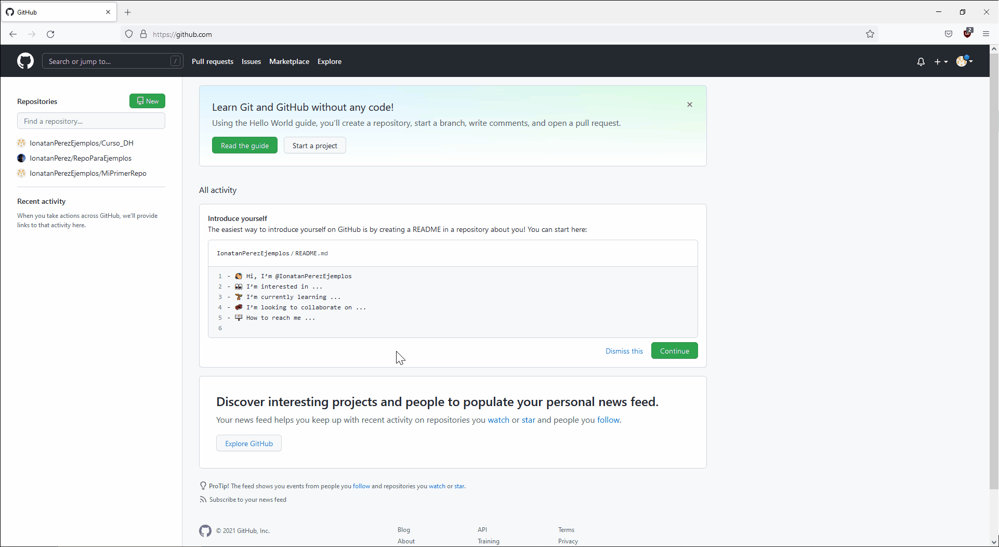

Visual Studio automáticamente se dio cuenta que no tenía nuestras credenciales de Github y las pide (las consigue a través del navegador). En caso de que hayamos hecho el clone por consola es probable que suceda lo mismo la primera vez que ejecutemos alguna instrucción que requiera permisos, por ejemplo un "push" (ya vamos a ver para qué sirve). Además un problema común es entender dónde se guardan las credenciales de acceso a Github. En Windows hay un gestor de credenciales que Git usa tercerizando al sistema operativo el manejo de las mismas. A continuación vemos como sería agregar las credenciales desde la consola y como borrar las credenciales si por alguna razón necesitamos cambiarlas. 


### status

```
git status
```

Sirve para que Git nos informe cuál es el estado de seguimiento del proyecto. Con este comando podemos saber si hay archivos modificados sin seguimiento, modificados con seguimiento pero no que fueron commiteados, commits que no se sincronizaron con Github o modificaciones en Github que no se sincronizaron con el repositorio local.

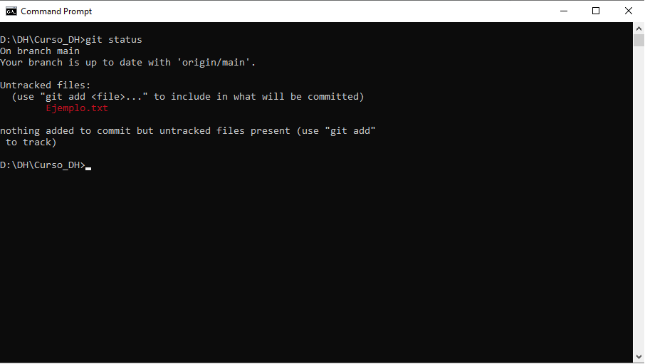

### pull

```
git pull
```
Sirve para pedir al servidor (Github por lo general) que nos envíe la última versión que hay online. En general se hace antes de un push por si alguien más (o nosotros en otra computadora) subimos cambios que no están en nuestra computadora local. 

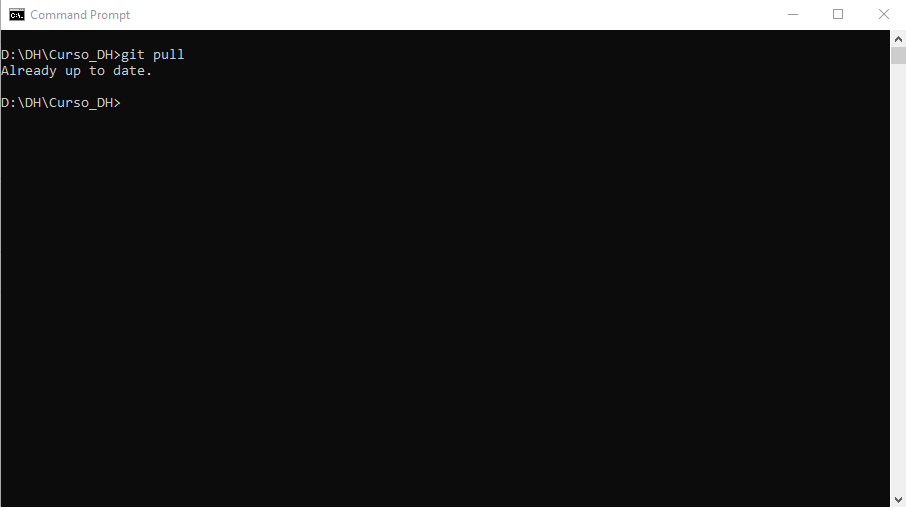

### add

```
git add [file] 
```

Agrega el archivo que nos interesa al stage. Con el comando --all agregamos todos los archivos que no tengan seguimiento en un solo paso. 

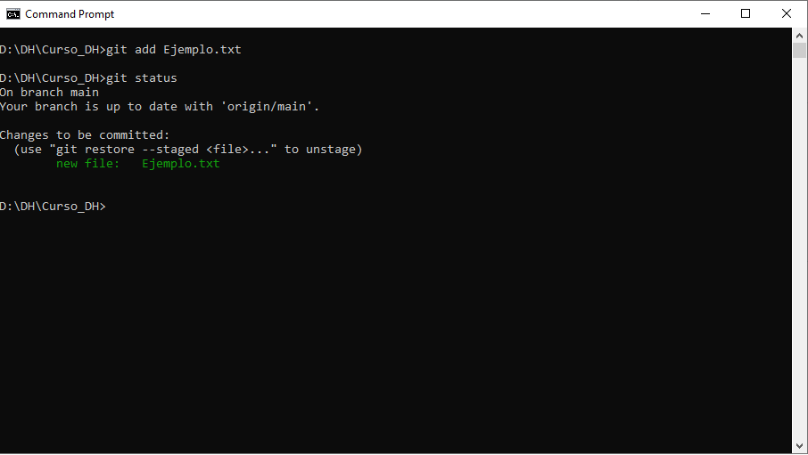

### commit

```
git commit -m "Explicacion del commit, en este caso estamos subiendo un archivo de prueba"
```

Commitea todo lo que haya en el stage al repositorio. Va acompañado de un mensaje explicativo. 

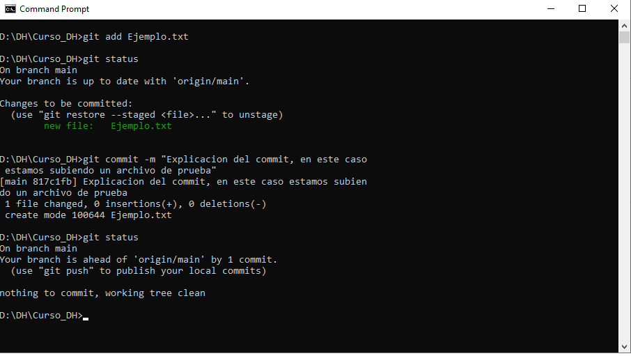

### push

```
git push
```

Sube al repositorio remoto la última versión del repositorio local. En caso de haya un conflicto de modificaciones requiere que primero hagamos un pull y resolvamos los conflictos.

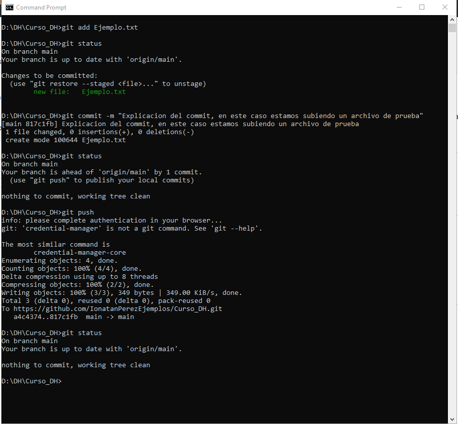


### Otros comandos

Si bien Git tiene un momento de opciones y manejar funciones avanzadas se puede volver complejo te dejamos un resumen con los comandos más usuales para que sepas que existen y que es lo que hacen


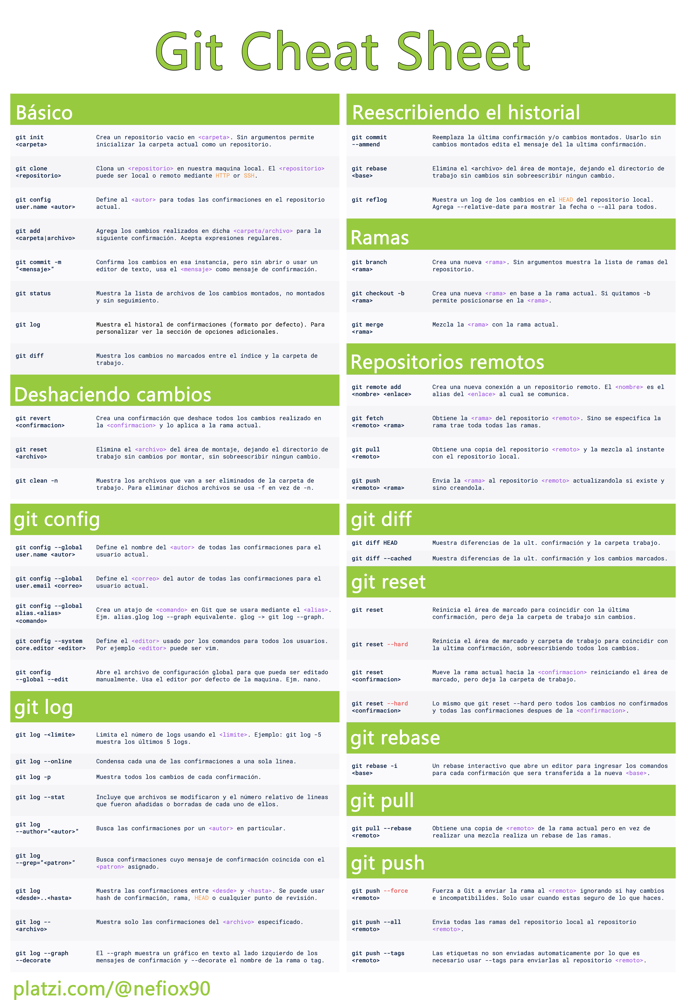

## Como acceder al repositorio del curso

Para terminar te proponemos poner en práctica lo que aprendimos creando una copia tuya de la info que hay que el repositorio del curso, de manera que puedas hacer todas las modificaciones que quieras sin alterar el original y puedas ir accediendo a las actualizaciones de contenido de forma automatica.

Para eso necesitamos lo siguiente:

1) El link del repositorio que queremos clonar. En este caso el link es https://github.com/IonatanPerez/Cursos_DHDS_CN13.git
2.a) Si usamos consola ir a la carpeta donde queremos que quede guardada la version local de nuestros archivos. Ahi ejecutar "git clone [URL DEL GIT]"
2.b) Si usamos VSC presionar ctr+shift+p y despues clone y pegar la URL. VSC nos va a pedir que elijamos donde queremos clonar el repositorio.
2.c) Abrir la interfaz grafica (GUI) de Git y poner clonar. Elegir donde queremos que se clone y tambien el link a clonar.
*En todos los casos considerar que cuando se clona un repositorio se crea una carpeta con el nombre del repositorio y dentro de esa carpeta se copian todos los archivos*
3) Cada tanto ir a la carpeta en la terminal terminal (o al proyecto en VSC) y poner "git pull" (o boton sync en VSC) eso recupera los archivos nuevos o modificaciones que se hayan hecho en la version online. 
*Tener en cuenta que como el respositorio es publico pero no cualquiera puede modificarlo pull funciona porque pide informacion publica, pero todos los comandos que sirven para subir a github los cambios realizados en la computadora local van a fallar. Si la inteción es tener un proyecto propio completo con su correspondiente copia en github hay que hacer lo que se llama un fork, eso permite tener un proyecto entero propio pero que se puede cada tanto sincronizar para pedir las actualizaciones con el proyecto del que se 'forkeo'. Para mas detalles leer https://docs.github.com/en/get-started/quickstart/fork-a-repo*

## Crear tu propio repositorio desde cero.

Te invitamos a que veas el video y trates de reproducirlo en tu computadora. 


## En conclusion...


