# Presentación

<!-- 
Recordar borrar estos comentarios andes de distribuir nada porque aunque no se vean el pdf quedan en el codigo.
-->

En esta guía queremos presentarte muy rápidamente algunos de los fundamentos conceptuales y prácticos que hay detrás de escena cuando preparás tu computadora para ejecutar un código de Python. Te vamos a contar ideas, trucos y herramientas para que entiendas mejor cómo es y cómo interactuar con el sistema operativo más allá de hacer doble clic en las cosas. 

## ¿Qué es un sistema operativo?

Estamos acostumbrados a que la computadora es la imagen que vemos en una pantalla, ya sea en un monitor de escritorio, en una tele o en la pantalla de la laptop, tablet o celular. [Pero no siempre fue así](https://youtu.be/kSolXVr0iFI). Lo que vemos y estamos acostumbrados a pensar como "la computadora" es simplemente la interfaz gráfica o GUI (Graphic User Interfaz). Detrás de esa interfaz hay muchísimo software (el sistema operativo) que sabe cómo interactuar con el hardware, y cómo hacer interactuar a los programas entre sí. Este nos da un entorno en el cual podamos hacer los usos que querramos y ejecutar los programa que querramos. 

El sistema operativo es a grandes rasgos un conjunto de muchos códigos que por un lado sabe cómo manipular el hardware y por otro nos ofrecen maneras lo más intuitivas posibles de indicarle a la computadora qué queremos hacer. El sistema operativo resuelve por nosotros la mayor parte de las cuestiones que tienen que ver con mantener la computadora andando de manera eficiente para que podamos usarla. Ver los archivos como dibujos en una pantalla, los programas como "ventanas" a través de las cuales podemos alternar o poder arrastrar cosas con el mouse o el dedo es exactamente eso, una manera muy cómoda e intuitiva de ver qué opciones nos ofrece la computadora y decirle que haga cosas muy complejas sin preocuparnos por cómo las hace.

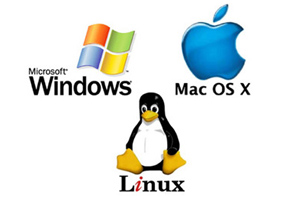

Sistemas operativos hay tantos como variantes de computadoras y códigos se quiera tener, sin embargo hoy día los sistemas operativos de las PC de escritorio (laptops) se pueden englobar en tres grandes variantes vinculadas a su lógica comercial y de funcionamiento.

Por un lado tenemos los sistemas operativos privativos (donde el código que se ejecuta no es público y es creado y mantenido por grandes empresas), estos son Windows (el sistema operativo para PC de Microsoft) y macOS (el sistema operativo que ofrece Apple para las Mac cuyo hardware no es del todo compatible con las demás PCs). 

Por otro lado tenemos sistemas operativos de código abierto desarrollados y mantenidos por la comunidad de programadores (y organizaciones sin fines de lucro cuya misión es coordinar y colaborar en el desarrollo de estos softwares). De estos hay muchas variantes, pero los más comunes son los que están basados en Linux (como Ubuntu, Mint, Fedora, etc.) que mantienen muy alto grado de compatibilidad entre sí y difieren en detalles de personalización.

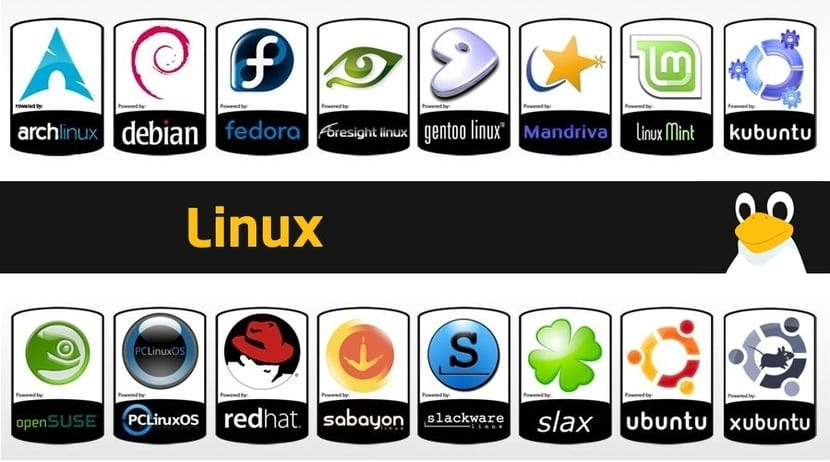

Si bien todos los sistemas operativos permiten al usuario ajustar y modificar su funcionamiento con diferente nivel de detalle, Linux, al ser la opción de código abierto no comercial, es la que mayor control y transparencia da al usuario a la hora de definir cómo y qué quiere que haga el sistema operativo.

## [El Hardware de una computadora](./Anexo_Hardware.md)

Si te interesa conocer los fundamentos de como funciona el hardware de una computadora y sus diferentes partes te invitamos a leer esta [sección](./Anexo_Hardware.md).

## Estructura de archivos

### Son todos ceros y unos

Toda la información que almacena y procesa una computadora se manipula como secuencias de ceros y unos. Estos valores se relacionan con que haya o no voltaje en cada uno de los conectores internos del hardware. Usando una secuencia de bits (ceros y unos) en [base binaria](https://es.wikipedia.org/wiki/Sistema_binario) se puede escribir cualquier número. Y Usando números y algún tipo de codificación se puede representar cualquier información. 

Por ejemplo, el [código ASCII](https://elcodigoascii.com.ar/) sirve para representar caracteres (e instrucciones comunes de textos como el ENTER o el borrar) usando los números del 0 al 127 que son 7 bits. Esto nos limita a los caracteres usuales del inglés. Si se quiere agregar más caracteres, emojis o símbolos se pueden usar más bits y usar una codificación más compleja. Un estándar común para manipular textos es [Unicode](https://es.wikipedia.org/wiki/Unicode) que sirve para representar caracteres en todos los idiomas. 

Otro ejemplo es la manipulación de imágenes. Para codificar imágenes se suele usar el formato [RGB](https://es.wikipedia.org/wiki/RGB). En este formato se parte la imagen en píxeles (cada pixel es un punto de color) y para indicar el color de cada pixel se usa su composición en rojo, verde y azul. Esta codificación es la más usual en todos los dispositivos digitales porque se vincula con cómo el ojo ve (el ojo humano tiene sensores para esos tres colores y con esa información el cerebro construye la idea de colores).

Es importante tener conciencia de estos detalles en el manejo de la información porque las secuencias de bits (que es como se guarda y se transmite la información), en sí no representan nada si no sabemos cómo interpretarla. A veces pasa que no se usan los mismos estándares para generar la secuencia de bits (encoding) que para interpretarla (decoding) y eso puede generar múltiples tipos de problemas, ejemplo típico cuando vemos caracteres raros que no corresponden en los subtítulos de una serie o película.

### Discos y unidades

La estructura de archivos (que son los contenedores de las secuencias de bits) se guarda físicamente dentro de los discos. Las computadoras suelen venir con al menos un disco rígido, pero a veces tienen más de uno. Además se pueden conectar discos rígidos externos o unidades de almacenamiento como pendrives. Más adelante mencionaremos el almacenamiento "en la nube". 

Sin embargo los discos físicos no son lo que vemos cuando usamos nuestro sistema operativo porque cada disco se puede partir en pedazos que funcionan para el sistema operativo como unidades diferentes. Por ejemplo, es común que cuando se instala un sistema operativo el mismo asigne parte del espacio físico del disco en particiones que usa en el arranque, como backup interno o como espacio de almacenamiento temporal (SWAP) y que no nos muestra (no tienen una letra asignada o no están "montadas"). 

Siempre tiene que haber al menos una unidad que es donde el sistema operativo va a tener sus archivos principales (Windows lo suele llamar "C:" y en Linux es "/"). Además puede haber otras que usemos para cosas diferentes (por ejemplo guardar los archivos personales en una unidad aparte para que no se mezclen con las cosas del sistema operativo, como si fuese un backup). Cuando conectamos un pendrive (o un disco externo) el sistema operativo los ve como una unidad diferente y le asigna una letra (en Windows) o un punto de montura (en Linux). 

En la siguiente imagen vemos un ejemplo (en Windows) de una computadora que tiene un único disco rígido (nombrado como "disco 0") que tiene tres unidades. Una esta reservada para el sistema y no se ve en el explorador de archivos, las otras dos figuran como unidades diferentes: el "Disco local C:" y el disco de "Datos D:". Como vemos además de la letra se les puede asignar un nombre descriptivo.

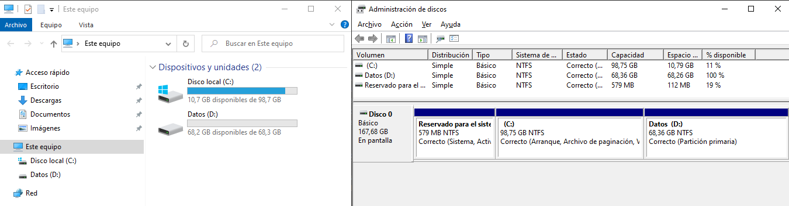

### Nombres de archivos y carpetas

Los archivos tienen un nombre (que aunque los sistemas operativos nuevos lo permiten es mejor que no tengan ni caracteres raros ni espacios) y una extensión. Ambas cosas se separan con un punto. La extensión no es más que un indicador del tipo de contenido que esperamos que haya dentro del archivo, pero no determina realmente el contendido. 

#### La extensión 

La extensión la suelen usar los sistemas operativos por ejemplo para proponer con qué programa abrir cada archivo. Si hacemos doble clic en un archivo que se llame "MiArchivo.pdf" el sistema operativo va a suponer que es un archivo de tipo PDF y va a tratar de abrirlo con un visor de PDFs. En cambio los archivos ".zip" son archivos comprimidos. Pero si le cambiamos el nombre a mano al archivo original por "MiArchivo.zip" va a seguir siendo el mismo PDF sin comprimir, solo que el sistema operativo (y cualquier usuario que no seamos nosotros) va a pensar que es un archivo comprimido. Si hacemos doble clic en el archivo el sistema operativo va a tratar de abrirlo con la aplicación de archivos comprimidos y esta va a dar un error. 

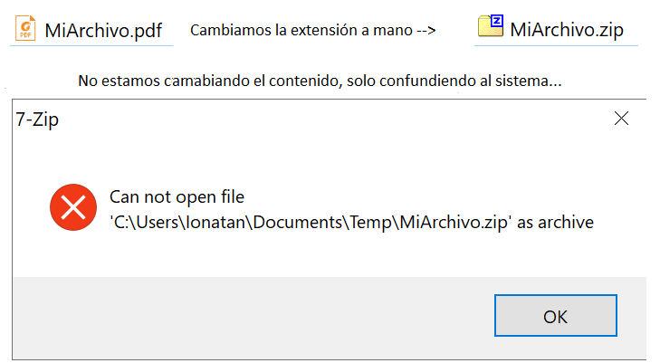

Normalmente uno no crea los archivos desde cero, sino que los crea con un programa, los programas automáticamente le agregan la extensión que corresponde al tipo de contenido que están manipulando, pero si por alguna razón uno necesita escribir el nombre, o hace o ejecuta, un programa que manipule archivos hay que tener en cuenta estos detalles. 

Para complicar más las cosas, en Windows se asume que el usuario no maneja los detalles detrás del sistema y de manera predeterminada el sistema operativo oculta las extensiones salvo que se cambie la configuración. La manera que tienen Windows de indicarnos que tipo de contenido debería tener un archivo es a través del icono con el que nos lo muestra. Para peor el sistema operativo acepta que un archivo tenga más de un punto "." en el nombre y solo considera el último como separado de extensiones. Entonces si tenemos un archivo que se llama "GranConfusion.pdf.zip" probablemente nos lo muestre con el icono de archivo comprimido, pero solo veamos "GranConfusion.pdf" en el explorador de archivos.

A continuación mostramos como configurar en Windows 10 para que muestre las extensiones de los archivos (muy recomendado).

#### Las carpetas

Los archivos además de tener un nombre y una extensión están en algún lugar dentro de la estructura de carpetas que hay en cada unidad. Todo el contenido de la unidad está en el directorio 'Raíz' que en Windows es la letra de la unidad seguida por ":\", típicamente "C:\" y en Linux "/". Mac comparte la mayor parte del funcionamiento interno con Linux porque está basado en Linux. Dentro de esa carpeta raíz puede haber archivos, pero lo más usual es que haya solo carpetas, y dentro de esas carpetas puede haber más carpetas o archivos.

La estructura de carpetas se separa en Windows con el simbolo "\\" y en Linux con el símbolo "/", aunque Windows también suele reconocer las notaciones de Linux y ser más "flexible", por ejemplo Windows no distingue mayúsculas de minúsculas cosa que Linux y la mayoría de los lenguajes de programación si hacen. 

De esta manera: 

**"C:\Users\Ionatan\Documentos\Temp\MiArchivo.zip"**

Hace referencia a un archivo que está en la carpeta "Temp" en la carpeta "Documentos" en la carpeta "Ionatan" en la carpeta "Users" en la unidad "C:"

Si en cambio tenemos:

**"C:\Users\Ionatan\Documentos\Temp\MiArchivo.zip\\"**

Al final hay una "\\" por lo que "MiArchivo.zip" es el nombre de una carpeta, no de un archivo.

#### Referencias relativas

Cuando un programa se ejecuta, se ejecuta en una carpeta (aunque normalmente no nos enteremos), si se quiere hacer referencia a otro archivo o carpeta se puede hacer en forma absoluta o relativa. Absoluta es escribir toda la indicación de la ubicación del archivo. Pero muchas veces queremos hacer cosas con archivos que están en la misma carpeta o en una carpeta vinculada y en qué parte de la computadora está ejecutándose nuestro programa no es relevante (imaginemos por ejemplo que se lo pasamos a otra persona que lo descarga en una carpeta que tiene nombres diferentes a los nuestros). Muchas veces poner la ubicación (o 'path') completa es un problema. En ese caso se puede usar una ubicación relativa respecto de donde estemos 'parados'.

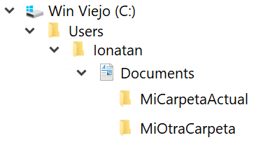

Por ejemplo para acceder a un archivo que esta en **"C:\Users\Ionatan\Documentos\MiOtraCarpeta\MiArchivo.zip"** si el programa se ejecuta en **"C:\Users\Ionatan\Documentos\MiCarpetaActual\"** (o sea hay dos carpetas diferentes en Documentos) podemos poner:

**"./../MiOtraCarpeta/MiArchivo.zip"**

El primer **"./"** indica que se parte de la carpeta actual. El segundo **"../"** indica que se debe retroceder un lugar en la estructura de carpetas. El **"MiOtraCarpeta/"** indica que hay que entrar en esa carpeta. El **"MiArchivo.zip"** indica que se debe buscar eso que es un archivo (porque no termina en "/")

#### Algunas confusiones usuales

En Windows <!-- P3 --> suele haber muchas confusiones cuando se trata de entender cómo funciona la estructura de archivos porque prioriza simplificar las cosas que muestra en función de un usuario que no quiere profundizar en como funciona el sistema. Un ejemplo de ello es lo que mencionamos antes cuando decíamos que en forma predeterminada oculta las extensiones de los archivos (y asume que cada programa va a guardar las cosas con la extensión correcta y que el usuario solo abre las cosas haciendo doble clic y por lo tanto puede ignorar la extensión mientras el archivo se abra). Otra situación que suele generar problemas es que existen muchas referencias simbólicas donde muestra 'carpetas' no en la estructura de archivos sino en otro lado, por ejemplos las "librerias" o los "Quick access" que se ven en la siguiente imagen:

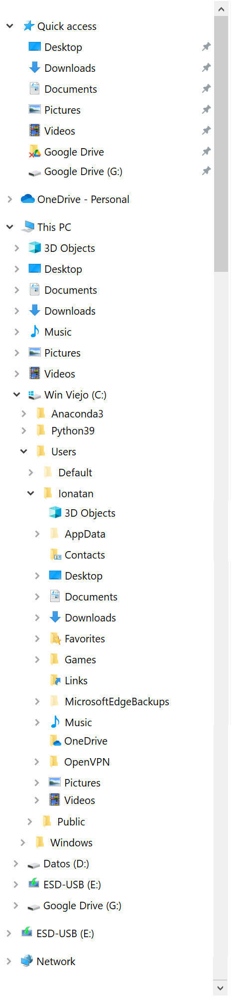

Si miramos vamos a ver que "Desktop" aparece en tres lugares, arriba de todo en "Quick access", más abajo, entre "This PC" y el disco "C:\" y dentro de la carpeta "Users\Ionatan" que es donde realmente está. Además esa carpeta escritorio es la que vemos "como fondo" cuando minimizamos todas las ventanas. Para más confusión si tuviésemos el Windows configurado en español en algunos lugares figuraría como "Escritorio" pero la carpeta real se llamaría "Desktop". Algo parecido pasa con 'el disco' "Google Drive" que no es una unidad real sino una simulación que genera la aplicación de Google que sincroniza los archivos desde el servicio de Google Drive con la computadora local. La carpeta local genuina es una carpeta como cualquier otra que probablemente esté en "Mis Documentos", pero la app de Google nos genera referencias por todos lados para que lo tengamos 'a mano' aunque no sea el lugar de la carpeta real. 

En Windows 10, el lugar real donde de manera predeterminada se ubican todas las carpetas con archivos personales (el escritorio, mis documentos, etc.) es en **"C:\users\\** *[Nombre del Usuario]* **\\"** pero por supuesto que cada programa o usuario puede guardar cosas en otros lados.

#### El almacenamiento en la nube

Además de tener archivos guardados físicamente en nuestros dispositivos es cada vez más común que todas nuestras cosas se sincronicen de una u otra manera con servidores de terceros al nivel que a veces ni siquiera conservamos una copia de nuestros archivos e información en nuestras propias computadoras. 

Al margen de la discusión conceptual respecto a la privacidad y los derechos sobre la información, esto implica que estos archivos no siempre son fácilmente accesibles por fuera de las propias plataformas que usemos 'en la nube'. Por ejemplo si para editar planillas de cálculo usamos Google Spreadsheet el contenido de esas planillas solo existe en los servidores de Google (salvo que descarguemos esas planillas explícitamente en un formato diferente). Por lo general los servicios en la nube incluyen algún tipo de herramientas para compartir los archivos, pero hay que distinguir entre links que permitan descargar los archivos y links que lleven a los servidores de la empresa para que visualicemos o editemos los archivos desde allí. 

Una situación intermedia sucede cuando sincronizamos alguna carpeta de nuestra computadora con algún servidor de archivos online (como lo son Google Drive, Dropbox, Microsoft One, etc.). En este caso si el tipo de archivos no es un tipo propio que manipula el servidor (el ejemplo anterior de una hoja de datos creada en formato Google Spreadsheet) si suele suceder que tengamos un reflejo de los contenidos que hay en el servidor en alguna carpeta de nuestra PC. Sin embargo qué cosas se sincronizan, que no, y dónde están guardados esos archivos localmente depende mucho de cómo hayamos configurado (o se haya hecho en forma predeterminada) el programa cuando lo instalamos. 

### La consola

Como mencionamos los sistemas operativos son mucho más que la interfaz gráfica que vemos y estamos acostumbrados a usar, y la mayoría de las cosas que suceden lo hacen por detrás de esa visualización. 

Todos los sistemas operativos tienen una o varias maneras de interactuar con el mismo sin interfaz gráfica mediante instrucciones escritas en texto. Para poder escribir esas instrucciones existen consolas que entienden estas instrucciones, las ejecutan e informan cosas (outputs de los programas). Obviamente en los sistemas operativos con interfaz gráfica esta consola se muestra dentro de una ventana como cualquier otro programa. 

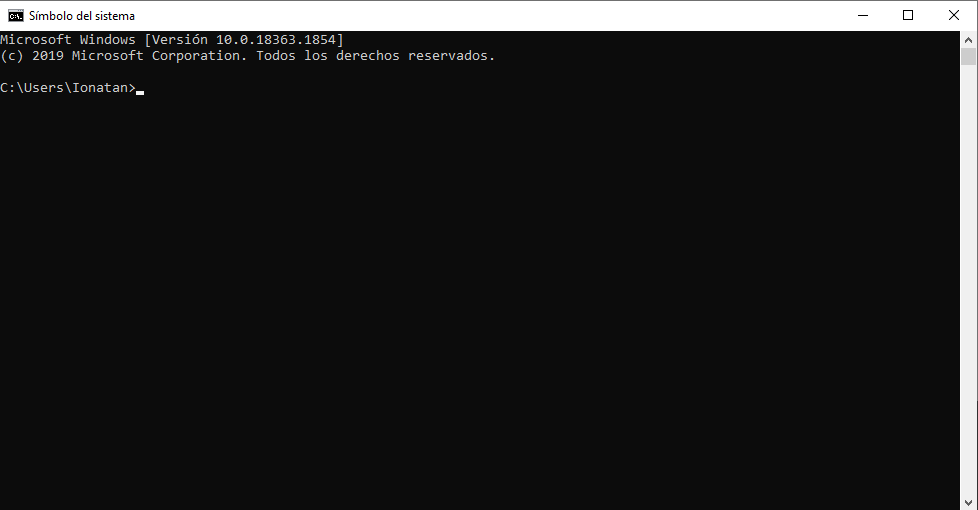

Además de la consola que provee el sistema operativo, muchos otros programas disponen consolas personalizadas que le agregan funcionalidades puntuales de dicha aplicación. Típicamente los entornos de programación permiten abrir una consola para poder ejecutar cosas sin necesidad ir a la consola del sistema o para mostrar los mensajes que los programas devuelven. También programas como Git o Conda tienen sus propias consolas desde donde dar instrucciones al sistema operativo con funcionalidades agregadas.

#### Como abrir una consola

En Windows hay varias maneras de abrir una consola, la primera es buscar en el menú inicio "Command Prompt", la segunda es presionar en el teclado "Windows+R" (que es el atajo para ejecutar programas) y escribir "cmd". Es probable que les figure la opción de ejecutar la consola como usuario común o como administrador por el momento lo vamos a hacer como usuario común, más adelante vamos a charlar el tema de los privilegios de administrador y que implica.

A la consola también se la suele llamar "Terminal" (porque en las primeras computadoras, antes de las PC, cada persona tenía físicamente un monitor y un teclado que era una terminal de una gran computadora). En Linux si buscamos la consola por lo general suele figurar como "Terminal", o se puede presiones "Ctrl+Alt+T" o "Ctrl+F2" que suelen ser atajos que abren una terminal.

#### Estructura de la consola

La consola es a la vez un lugar donde se pueden escribir comandos y ver qué mensajes dejan los comandos o programas que se ejecutan. Los comandos se escriben en la última línea donde un "_" parpadeante nos indica que estamos escribiendo. Al presionar la tecla "Enter" se ejecutará todo lo que se haya escrito (que puede ocupar más de una línea si incluye nombre de archivos o carpetas largos). 

A su vez la consola nos informa siempre en que carpeta estamos parados cuando ejecutamos un comando, en la imagen de arriba podemos ver **"C:\Users\Ionatan>"** lo que significa que lo que vayamos a ejecutar se ejecutará en la carpeta **"C:\Users\Ionatan\\"**.

Los sistemas operativos incluyen algunos comandos básicos que permiten interactuar con el sistema de archivos (copiar, moverse entre carpetas, renombrar cosas, etc.). Por ejemplo en Windows el comando "dir" muestra el contenido de un directorio (el equivalente en Linux es "ls"). En la siguiente imagen podemos ver lo que devuelve (el output) al hacer "dir" en la carpeta principal de un usuario de Windows. Como habíamos mencionado antes, en esta carpeta es donde de manera predeterminada están las carpetas "Mis Docuementos", "Escritorio", etc. Además hay cosas que cuando otros programas se instalan van agregando a esta carpeta. En Linux el "." delante de los archivos o carpetas indica que son archivos ocultos, es decir que no están pensando para que el usuario los vea en el día a día, sino para almacenar cosas de los propios programas. En Windows que un archivo esté configurado como oculto es una propiedad que se configura de otra manera, por eso estos archivos los muestra.

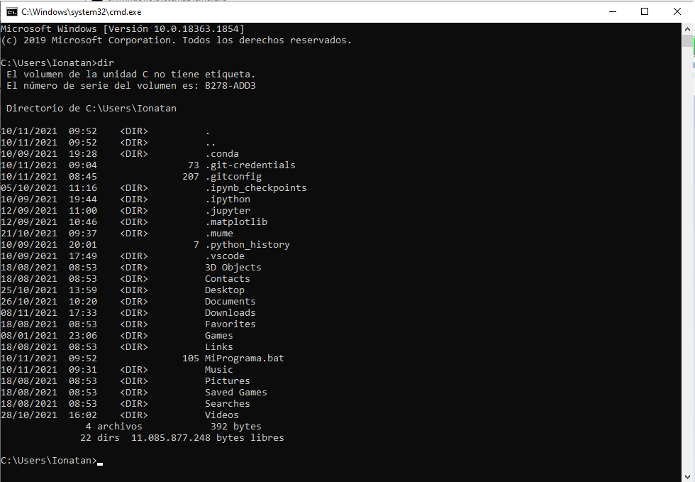

#### Ejecutar un programa

En la imagen anterior vemos que dentro de la carpeta en la que estábamos hay carpetas (las indicadas con **"\<DIR\>"**) y archivos (el resto). Además el comando "dir" nos muestra otra información que puede ser útil, como la fecha y hora de última modificación de los archivos o carpetas, el tamaño de los archivos en bytes (por ejemplo "MiPrograma.bat" ocupa 105 bytes) y el espacio que queda libre en la unidad. 

El archivo "MiPrograma.bat" (que pueden descargar desde este [link](Archivos/MiPrograma.bat)) es un archivo que dentro tiene texto, pero al ponerle la extensión ".bat" le estamos indicando al sistema operativo que tiene instrucciones que se pueden ejecutar en una consola de Windows (lo mismo sucede si le ponemos extensión ".cmd", en linux en cambio se indica con ".sh"). Si abrimos el archivo con un editor de texto (si hacen doble clic lo van a ejecutar en lugar de abrir para ver el contenido) podemos ver que tiene dentro.

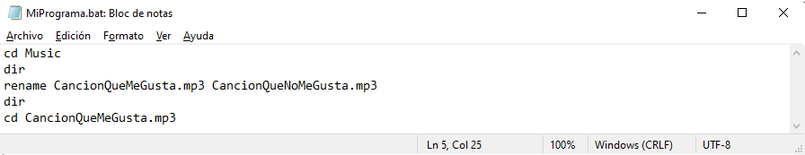

Este código le pide a la computadora que entre en la carpeta "Music", que muestre que hay dentro y que renombre un archivo (que pueden [descargar](Archivos/CancionQueMeGusta.mp3) y colocar en su carpeta "Music") cuyo nombre es "CancionQueMeGusta.mp3" por "CancionQueNoMeGusta.mp3". La instrucción "rename" (al igual que la mayoría de las instrucciones) acepta parámetros, es decir información a considerar cuando tenga que hacer las cosas que pedimos. En este caso rename necesita primero el nombre del archivo original y luego el nombre nuevo que le queremos asignar. Una vez renombrado el archivo el código vuelve a hacer un "dir" para mostrar cómo quedó el contenido de la carpeta y por último intenta entrar a la carpeta "CancionQueMeGusta.mp3", lo cual claramente no tiene sentido y debería generar algún tipo de error.

Para ejecutar un programa desde la consola tenemos que poner el nombre (podemos ponerlo sin el ".bat"). Lo primero que hace el sistema operativo es ver si encuentra algo con ese nombre en la carpeta actual. Obviamente no todos los programas que tiene una computadora están en la carpeta actual por lo que a continuación el sistema operativo busca si tiene registrado algo que pueda ejecutar con ese nombre (como funciona esto depende de cada sistema operativo, pero suele haber algunas carpetas y archivos específicos donde se guarda esta información). Cuando los programas que usamos en la computadora se instalan, entre otras cosas, registran su nombre y donde hay que buscar el ejecutable correspondiente.

A continuación vamos a ver que sucede si tratamos de ejecutar el programa (si tienen Windows y descargaron los archivos en los lugares correctos y abrieron la consola pueden probar ejecutarlo ustedes): 

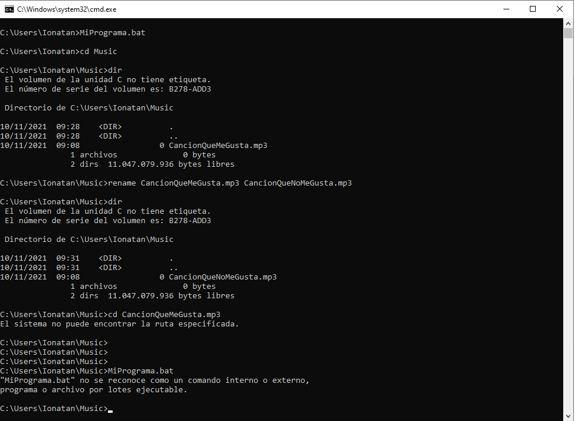

Observamos que el sistema operativo entra en la carpeta Music, que muestra el contenido (todavia está el archivo con el nombre original), que se ejecuta la instrucción para cambiar el nombre (lo cual no genera ningún output), que luego al hacer "dir" nuevamente figura el archivo con el nombre nuevo, y vemos que efectivamente la última línea del código genera un error. Es importante que todos los errores generan un output que hay que aprender a mirar. Esta es la manera que tienen los programas de explicar que está fallando y ayudarnos a que encontremos la solución. En este caso el mensaje es bastante claro: no se encontró la carpeta a la que queremos entrar. 

Por último probamos volver a ejecutar el mismo programa volviendo a escribir el nombre del archivo que tenía el código, sin embargo esta vez no funcionó. Les dejamos como pregunta pensar porque, si escribimos el mismo nombre que en la primera línea de la imagen.

#### Consolas especiales

En Windows hay un tipo de consola más potente (tiene más funcionalidades) que la tradicional, se llama PowerShell. La diferencia es que tiene comandos más complejos incorporados y [permite hacer scripts](https://docs.microsoft.com/en-us/powershell/scripting/overview?view=powershell-7.2) o programas que hacen cosas que la consola tradicional no puede hacer, como por ejemplo instalar y desinstalar programas, etc.

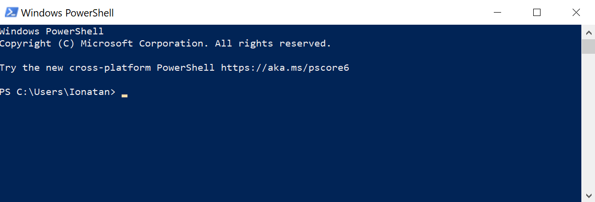

Por otro lado, programas como Git, Conda, VisualStudioCode y otros que asumen que quien los usa tiene interés en poder escribir instrucciones a mano, tienen sus propias versiones de la consola y cuando se usan ofrecen la opción de abrir una consola específica para usar esos programas (además tienen interfaces gráficas por supuesto). Es importante esta distinción, porque la alternativa (que suele ser ofrecida en algún casillero de verificación a la hora de la instalación) es que registren en el sistema todas las instrucciones propias para que desde cualquier consola se puedan usar los comandos. La ventaja de esto último es que no hay que estar cambiando de tipo de consolas, la desventaja es que pueden terminar interfiriendo con el funcionamiento de otros programas que también usen consola. 

A continuación mostramos un ejemplo en Windows de como Git nos ofrece opciones de ejecutarse con interfaz gráfica (GUI), o desde una consola propia (opciones CMD y Bash) cuando buscamos el programa en el menú inicio.

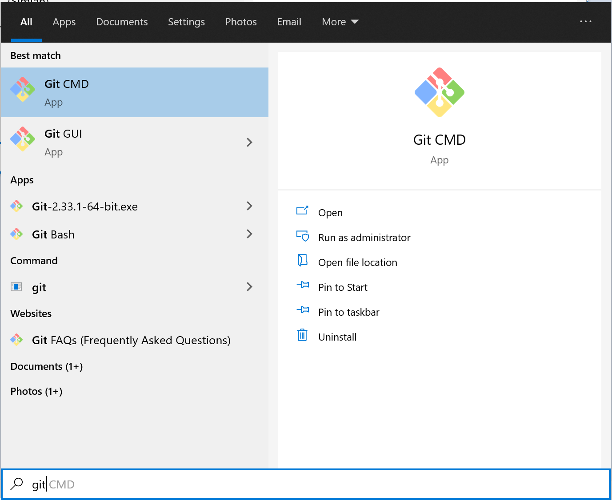

#### Permisos de administrador

Todos los sistemas operativos tienen archivos e información que está pensada para que la edite y modifique cada usuario (porque tienen que ver con su contenido propio o sus preferencias) y archivos e información que es general del sistema operativo y no debería ser modificado por un usuario cualquier a menos que tenga intención de modificar cosas estructurales de la computadora. 

Esta distinción, además de evitar que un usuario común 'meta la pata', tiene una cuestión de seguridad vinculada. Si de alguna manera un código malicioso se ejecuta en la computadora a partir del accionar de un usuario común el código está imposibilitado de acceder o modificar la información sensible del sistema operativo. Para esto los sistemas operativos distinguen entre usuarios comunes y administradores. Muchas veces (generalmente cuando tenemos un solo usuario), en realidad el usuario es simultáneamente usuario común y administrador, pero para hacer ciertas acciones especiales el sistema operativo solicita acceso de administrador como medida de protección (esto suele incluir por ejemplo que se introduzca de nuevo la contraseña en Linux, o en Windows hay que dar ok a un mensaje). 

Las consolas (al igual que todos los programas) cuando se ejecutan lo hacen como usuario común (nos damos cuenta que se inician en la carpeta del usuario si miramos los ejemplos de arriba), salvo que indiquemos que queremos ejecutarlas como administrador, en cuyo caso le estamos dando acceso para que puedan modificar archivos y configuraciones del sistema. Si observamos en la siguiente imagen vemos que al iniciar en Windows una consola como admin (además de poner un mensaje pidiendo permiso explícito y alertando que la aplicación va a tener acceso de administrador) lo aclara en el título de la ventana, y la carpeta en la que se inicia es una carpeta interna de Windows donde está el propio programa de la consola.

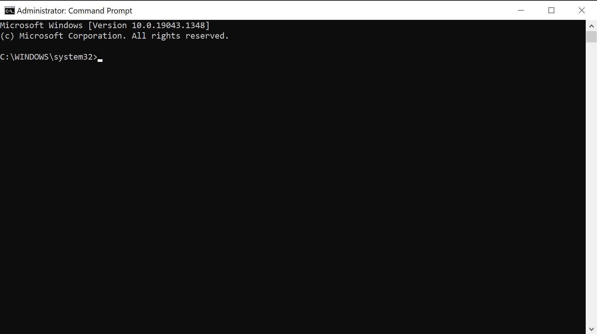

En los sistemas operativos Linux, la distinción entre si un comando se ejecuta como administrador o no, no depende de si la consola se abrió como admin, sino que se puede indicar delante de la línea a ejecutar usando la palabra "sudo". Esto permite un mejor control de los permisos porque significa que solo le estamos pidiendo que ejecute esa instrucción con permisos de administrador (para lo cual nos va a pedir la contraseña correspondiente). 

Como medida de seguridad general los programas no se deberían necesitar ejecutar con derecho de administrador salvo que tengamos claro porque lo requieren. Situaciones en las que típicamente hace falta darles permiso de administrador son las siguientes:

- Cuando se quiere instalar un programa para todos los usuarios (muchos programas se pueden instalar solo para el usuario particular sin necesidad de modificar cosas del sistema operativo)
- Cuando se quiere instalar o ejecutar un programa que altere cosas generales del sistema operativo
  
Típicamente las cosas que se hacen en consola no necesitan acceso de administrador, pero a veces cuando estamos instalando librerías o funcionalidades extras por ejemplo en Anaconda (gestor de paquetes que vamos a usar para Python), dependiendo de que librerías se quiera instalar o modificar y de como se haya instalado Anaconda puede que si no ejecutamos la consola como administradores surja algún error. En todo caso es cuestión de aprender a leer los errores y, si es necesario, volver a ejecutar el comando como admin.